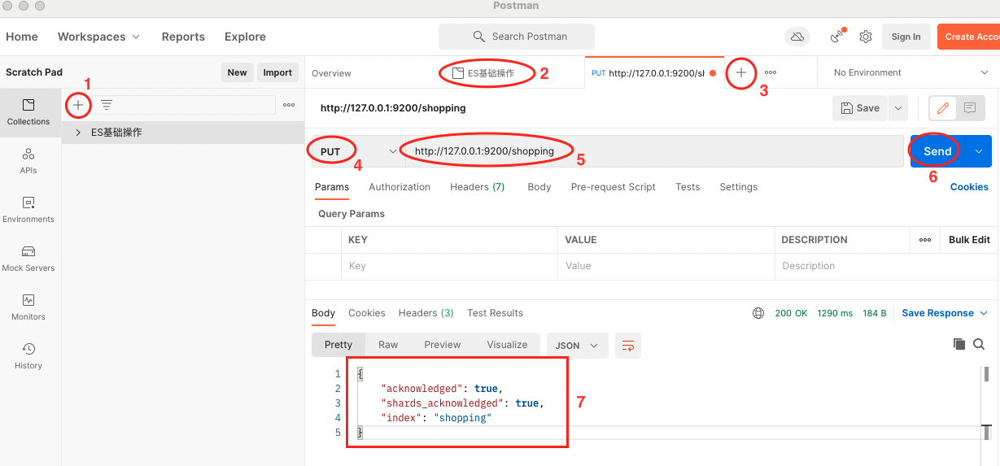
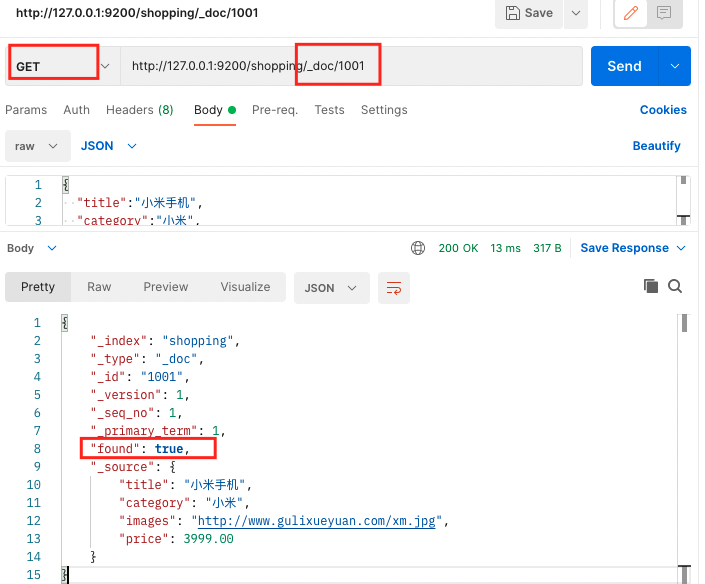

# Elasticsearch

教程参考尚硅谷：https://www.gulixueyuan.com/goods/show/534

版本：7.8.0

es官网：https://www.elastic.co/cn/elasticsearch/

es文档：https://www.elastic.co/guide/en/elasticsearch/reference/7.8/index.html

这里先学习es7.8，之后再来看最新版本的变化

## 第1章 Elasticsearch概述

### 1.1 什么是ES

Elastic Stack（也称作ELK Stack）包括 ES、Kibana、Beats和Logstash。能够安全可靠的获取各种来源和格式的数据，然后进行实时的数据搜索、分析和可视化。


Elasticsearch（ES）是一个开源的高扩展的**分布式全文搜索引擎**，是Elastic Stack技术栈的核心。


ES的特点：

- 可以几乎实时的存储、检索数据
- 扩展性好，可以扩展到上百台服务器，处理PB级别的数据


### 1.2 全文搜索引擎

这里的全文搜索引擎指的是**目前广泛应用的主流搜索引擎**。它的工作原理是计算机索引程序通过**扫描文章中的每一个词，对每一个词建立一个索引，指明该词在文章中出现的次数和位置，当用户查询时，检索程序就根据事先建立的索引进行查找，并将查找的结果反馈给用户的检索方式**。这个过程类似于通过字典中的检索字表查字的过程。


### 1.3 Elasticsearch和Solr

在Java环境中**Lucene**是一个免费的开源工具。Lucene提供了一个简单强大的应用程式接口，能够做全文索引和搜寻。Lucene是近几年最受欢迎的免费Java信息检索程序库。

但**Lucene**只是一个提供全文搜索功能类库的**核心工具包**，真正使用它还需要搭建一个完善的服务框架进行应用。


目前市面上流行的搜索引擎软件，主流的就是：Elasticsearch和Solr，这两款都是基于Lucene搭建的，可以独立部署启动的搜索引擎服务软件。两者内核相同，因此服务器安装、部署、管理、集群类似，对数据的操作、修改、添加、保存、查询等都类似。


在使用时会将两者进行对比选型，各有优缺点。


## 第2章 Elasticsearch入门

### 2.1 Elasticsearch安装

#### 2.1.1 下载软件

ES的官方地址：https://www.elastic.co/cn/

ES最新的版本是8.2(截止2022.5.7)

下载地址：https://www.elastic.co/cn/downloads/elasticsearch

====================================================================

选择7.8.0版本，macos下载得到一个安装包，解压如下：


#### 2.1.2 启动软件

在`bin`目录下：

- `elasticsearch`文件使用终端打开启动es

  ```bash
  启动完毕后会显示两个端口号：
  9300端口为ES集群间组件的通信端口
  9200端口为浏览器访问的http协议RESTful端口
  #[2022-05-07T12:34:38,198][INFO ][o.e.t.TransportService   ] [fengwennideMacBook-Pro.local] publish_address {127.0.0.1:9300}, bound_addresses {[::1]:9300}, {127.0.0.1:9300}
  #[2022-05-07T12:34:42,301][INFO ][o.e.h.AbstractHttpServerTransport] [fengwennideMacBook-Pro.local] publish_address {127.0.0.1:9200}, bound_addresses {[::1]:9200}, {127.0.0.1:9200}
  
  
  在浏览器中输入：http://localhost:9200/
  如果页面中显示如下内容，则说明es启动成功：
  {
    "name" : "fengwennideMacBook-Pro.local",
    "cluster_name" : "elasticsearch",
    "cluster_uuid" : "ko_1QUxFQOebO7KGgNhLpg",
    "version" : {
      "number" : "7.8.0",
      "build_flavor" : "default",
      "build_type" : "tar",
      "build_hash" : "757314695644ea9a1dc2fecd26d1a43856725e65",
      "build_date" : "2020-06-14T19:35:50.234439Z",
      "build_snapshot" : false,
      "lucene_version" : "8.5.1",
      "minimum_wire_compatibility_version" : "6.8.0",
      "minimum_index_compatibility_version" : "6.0.0-beta1"
    },
    "tagline" : "You Know, for Search"
  }
  ```


#### 2.1.3 安装启动常见问题

- ES是用java开发的，且7.8版本的ES需要JDK1.8以上，如果系统配置了默认的JDK那么使用系统的JDK，如果没有配置使用安装包中自带的JDK。

- 双击启动窗口闪退，通过路径访问追踪错误，如果是“空间不足”，可以修改`config/jvm.options`配置文件

  


### 2.2 客户端安装

如果直接通过浏览器向Elasticsearch服务器发送请求，那么需要在发送的**请求中包含HTTP标准的方法**。

而HTTP的大部分特性仅支持**GET**和**POST**方法。

所以为了能方便的进行客户端访问，可以使用**Postman**软件。


Posman是一款网页调试工具，提供强大的WebAPI和HTTP请求调试功能。中文版能发送任何类型的HTTP请求（GET，POST，PUT，DELETE等）。不仅能提交表单，还能附带任意类型的请求体。


**Postman官网**：https://www.postman.com/downloads/


### 2.3 数据格式

Elasticsearch是面向文档型的数据库，一条数据就是一个文档。ES存储文档数据和MySQL存储数据类比如下：


Index：相当于库

Types：相当于表（ES 7.x中Type的概念已经被删除了）

Documents：相当于表的行

Fields：类似于列


## 第3章 ES之HTTP操作

### 3.1 索引操作

#### 3.1.1 创建索引

对比关系型数据库，创建索引就等同于创建数据库。

步骤：

- 启动ES：bin目录下双击elasticsearch文件
- 打开Postman创建一个连接
- 在Postman中，向ES服务器发PUT请求：http://127.0.0.1:9200/shopping。显示如下第7步中的json字符串时就表示创建成功了。（**PUT请求就表示创建**）


#### 3.1.2 查看索引信息

经过上面的步骤就创建好了一个索引，下面查看：

- 将PUT换成GET，会显示`http://127.0.0.1:9200/shopping`的索引信息，即如下json字符串：

  ```json
  {
      "shopping": {
          "aliases": {},
          "mappings": {},
          "settings": {
              "index": {
                  "creation_date": "1652061957838",
                  "number_of_shards": "1",
                  "number_of_replicas": "1",
                  "uuid": "AFGvm8QpRJWILQ0_JrcOyg",
                  "version": {
                      "created": "7080099"
                  },
                  "provided_name": "shopping"
              }
          }
      }
  }
  ```

- 另外也可以使用`http://127.0.0.1:9200/_cat/indices?v`来查看当前所有的索引（**_cat/indices?v**）：

  


#### 3.1.3 删除索引

- 使用**DELETE方法**来删除索引

  


### 3.2 文档操作

#### 3.2.1 创建文档(增)

在上一小节中已经创建好了索引，接下来创建文档并添加数据。这里的文档可以类比为关系型数据库中的表数据，添加的数据格式为JSON格式。步骤如下：

- 启动ES：bin目录下双击elasticsearch文件

- 打开Postman创建一个连接

- 在Postman中，向ES服务器发POST请求：http://127.0.0.1:9200/shopping/_doc（**_doc表示在索引中添加文档数据**）。如下图中，响应信号返回一个错误。

  这个错误是说：请求体是必须要有的，现在没有请求体

  

  在Body中增加JSON格式的请求体如下，设置成功后会显示"created"：

  ```json
  {
    "title":"小米手机",
    "category":"小米",
    "images":"http://www.gulixueyuan.com/xm.jpg",
    "price":3999.00
  }
  ```

  

  在上图中，返回结果中有一个`_id`(相当于主键)，每次点击send按钮，这个值都会改变：

  

  可以在URL后增加id，那么此处的`_id`就不会改变了：

  

#### 3.2.2 查询文档(查)

##### 1）"主键"查询

使用**GET方法**来查询文档，URL中`_doc`表示文档数据，`/1001`表示文档ID。查询结果中`found:`表示是否查询到结果。

- 文档存在的查询结果如下：



- 文档不存在的查询结果如下：

  


##### 2）全部查询

> 两种操作的查询方式

- 路径查询：URL中使用`_search`来进行全部查询，使用`GET方法`，但是body中不能有数据
- 请求体查询：URL`_search`，使用`GET方法`，body中`query`+`match_all`匹配全局查询条件


> 实例演示

- URL路径查询：

  使用`_search`来进行全部查询，使用`GET方法`。

  查询时需要删除body中的数据，不然会报`"reason": "Unknown key for a VALUE_STRING in [title]."`错误。


- 请求体查询：url中增加`_search`，body请求体中`query`+`match_all`匹配全局查询，`GET`方法


##### 3）条件查询

> 介绍两种条件查询方法

使用`GET方法`可以有以下两种查询方法：

- 路径查询：`_search?q=字段:值`
- 请求体查询：url`_search`，body中`match`


> 实例演示：

- 路径查询：`_search`表示查询，`q=字段:值`用来匹配条件，`GET`方法


- 请求体查询：URL中只写`_search`，body请求体中使用`query`+`match`匹配条件，`GET`方法

  (注意：`query`+`match_all`表示全局查询)


##### 4）分页查询

使用`GET`方法，url`_search`：

- 然后body请求体`query`+`match_all`查询全部数据，
- body请求体`from`确定页起始（`(页码-1)*每一页数据条数`）
- body请求体`size`确定每一页条数
- body请求体`"_source":["字段"]`查询特定的字段
- body请求体`sort`+`字段`+`"order":asc或desc`排序


##### 5）多条件组合查询

将多个条件组合在一起查询时，请求体应该怎么写？

`GET`方法，url`_search`(http://127.0.0.1:9200/shopping/_search)，body`raw`+`JSON`，然后写入以下数据：

- 多个条件同时成立

```json
{
	"query":{    // 表示查询
		"bool":{   // 表示条件
			"must":[ // 表示多个条件同时成立
				{      // 第1个条件
					"match":{  // 匹配规则
						"category":"小米"
					}
				},
				{            // 第2个条件
					"match":{  // 匹配规则
						"price":3999.00
					}
				}
			]
		}
	}
}
```

- 多个相同的条件只要有一个成立就可以

```json
{
	"query":{    // 表示查询
		"bool":{   // 表示条件
			"should":[ // 表示多个条件同时成立
				{      // 第1个条件
					"match":{  // 匹配规则
						"category":"小米"
					}
				},
				{            // 第2个条件
					"match":{  // 匹配规则
						"category":"华为"
					}
				}
			]
		}
	}
}
```

- 范围查询（字段值>,<,≤......）：增加`filter`+`range`+`字段`+`gt等`

```json
{
	"query":{    // 表示查询
		"bool":{   // 表示条件
			"should":[ // 表示多个条件同时成立
				{      // 第1个条件
					"match":{  // 匹配规则
						"category":"小米"
					}
				},
				{            // 第2个条件
					"match":{  // 匹配规则
						"category":"华为"
					}
				}
			],
      "filter":{     // 过滤条件
        "range":{    // 查询范围
          "price":{  // 对应的字段
            "gt":1000// gt表示大于，这里是price字段>1000的记录
          }
        }
      }
		}
	}
}
```


##### 6）模糊查询和精确查询

`match`可以使用模糊的文字进行全文检索，`match_phrase`将值看做一个整体进行精确查询。

关于match部分查询的具体原理百度理解。

- match模糊查询：

  ```txt
  下图中，match中的字段值为”小华“。
  所有记录中没有”小华“，但是查询到两条结果，
  其中一条包括”小“，另一条包括”华“。
  这是因为查询时，会将这两个字拆分，然后去全文倒排索引（根据值来查记录），计算一个得分，
  最终得到查询结果。
  ```

  

- match_phrase精确查询：

  ```txt
  如果想要使得字段值为完整连续的查询字符串，可以将match换成match_phrase。
  此时”小华”查不到结果，只有改成“小米”或”华为“才能查询到结果。
  ```

  


##### 7）高亮查询结果

使用`highlight`+`fields`来高亮查询字段。

在查询结果中可以看到高亮的地方增加了`<em></em>`标签。


##### 8）分析或分组查询结果

对查询结果进行分析(求和、均值等)或分组，要修改请求体。


##### 9）映射关系

**引出问题：**

如何确定查询时是否为分词查询（模糊查询或者完全匹配）？

ES中有映射的概念，


**实例演示：**

1. 首先创建一个新的索引`/user`
    

2. 然后创建索引的结构信息：url中`_mapping`，`PUT`方式，body中的增加json格式的映射字段

   

3. 将上一步中的`PUT`换成`GET`方法，查看前两步设置的数据映射信息，：

   

4. 准备一些数据，用来验证上一步中的映射条件是否生效：创建id为1001的记录

   

5. 使用上一步创建的数据来进行映射效果测试：

   - 验证`type:text`是否会分词查询：body请求体中编写如下查询字段，查询名字`小`——可以查到名字中包含小的记录，说明text可以分词模糊查询

     

   

   - 验证`type:keyword`是否会分词查询：body请求体中编写如下查询字段，查询性别`男`——查不到。说明keyword对应的属性只能精确查询，不能分词模糊查询

     ```json
     {
         "query":{
             "match":{
                 "sex":"男"
             }
         }
     }
     ```


#### 3.2.3 修改文档(改)

数据创建成功后想修改应该如何处理？分为两种情况：完全覆盖性修改(全量数据更新)和局部性修改

> 全量数据更新

无论发送多少次请求，数据都会完全被覆盖，具有幂等性。

使用`PUT方法`来操作，`_doc`表示文档数据，`1001`是具体的ID号(相当于主键)。


> 局部数据更新

局部数据更新使用`POST`方法，body中只写入需要更新的内容。


#### 3.2.4 删除文档(删)

删除文档使用`delete`方法。

注意body中不能有数据。

- 第一次删除某个文档的结果如下：


- 再次点击删除结果中会返回`not_found`：


## 第4章 ES之JavaAPI

### 4.1 Elasticsearch-IDEA环境准备

ES软件是由Java语言开发的，所以也可以通过JavaAPI的方式对ES服务进行访问。

IDEA和ES结合使用的步骤如下。


> 1. 创建maven项目

首先创建maven项目`ElasticsearchProject`，在项目中新建`es-test`模块。

在`es-test`模块中添加es相关的依赖如下：

```xml
    <dependencies>
        <dependency>
            <groupId>org.elasticsearch</groupId>
            <artifactId>elasticsearch</artifactId>
            <version>7.8.0</version>
        </dependency>

        <!--elasticsearch客户端-->
        <dependency>
            <groupId>org.elasticsearch.client</groupId>
            <artifactId>elasticsearch-rest-high-level-client</artifactId>
            <version>7.8.0</version>
        </dependency>

        <!--elasticsearch 依赖2.x的log4j-->
        <dependency>
            <groupId>org.apache.logging.log4j</groupId>
            <artifactId>log4j-api</artifactId>
            <version>2.8.2</version>
        </dependency>
        <dependency>
            <groupId>org.apache.logging.log4j</groupId>
            <artifactId>log4j-core</artifactId>
            <version>2.8.2</version>
        </dependency>
        <dependency>
            <groupId>com.fasterxml.jackson.core</groupId>
            <artifactId>jackson-databind</artifactId>
            <version>2.9.9</version>
        </dependency>
        <dependency>
            <groupId>junit</groupId>
            <artifactId>junit</artifactId>
            <version>4.12</version>
        </dependency>
    </dependencies>
```

> 2. 创建java类测试

先创建包`com.nini.es.test`，然后创建类`ESTest_Client.java`：

```java
package com.nini.es.test;
import org.apache.http.HttpHost;
import org.elasticsearch.client.RestClient;
import org.elasticsearch.client.RestHighLevelClient;

import java.io.IOException;

public class ESTest_Client {
    public static void main(String[] args) throws IOException {
        // 创建ES客户端: 传入ip、port、http方式
        RestHighLevelClient restHighLevelClient = new RestHighLevelClient(
                RestClient.builder(new HttpHost("localhost", 9200, "http"))
        );

        // 关闭es客户端
        restHighLevelClient.close();
    }
}
```

运行上述代码，如果正常结束则说明`es连接成功，并且能正常结束`：

```java
/Users/hillking/Environment/Java/JDK/jdk-11.0.12.jdk/Contents/Home/bin/java ...

Process finished with exit code 0
```

之后就可以在此基础上进行**coding**了!


### 4.2 索引操作

#### 1）创建索引

在ES服务启动的状态下(终端运行bin目录中的文件)，继5.1节中的操作后，创建`ESTest_Index_Create.java`。在本地没有`user`索引的条件下，使用下面的代码可以创建`user`索引：

```java
package com.nini.es.test;
import org.apache.http.HttpHost;
import org.elasticsearch.client.RequestOptions;
import org.elasticsearch.client.RestClient;
import org.elasticsearch.client.RestHighLevelClient;
import org.elasticsearch.client.indices.CreateIndexRequest;
import org.elasticsearch.client.indices.CreateIndexResponse;
import java.io.IOException;

public class ESTest_Index_Create {
    public static void main(String[] args) throws IOException {
        // 创建ES客户端: 传入ip、port、http方式
        RestHighLevelClient restHighLevelClient = new RestHighLevelClient(
                RestClient.builder(new HttpHost("localhost", 9200, "http"))
        );
        // 创建索引
        CreateIndexRequest request = new CreateIndexRequest("user");   // 创建名字为user的索引
        CreateIndexResponse response = restHighLevelClient.indices().create(request, RequestOptions.DEFAULT);// create方法第二个参数是一个默认的参数，直接使用

        // 响应状态
        boolean acknowledged = response.isAcknowledged();
        System.out.println("索引操作：" + acknowledged);


        // 关闭es客户端
        restHighLevelClient.close();
    }
}

=================================================================================
其中创建索引的关键步骤为：
// 创建索引
CreateIndexRequest request = new CreateIndexRequest("user");   // 创建名字为user的索引
CreateIndexResponse response = restHighLevelClient.indices().create(request, RequestOptions.DEFAULT);// create方法第二个参数是一个默认的参数，直接使用

// 响应状态
boolean acknowledged = response.isAcknowledged();
```

运行后的返回结果如下说明响应成功：

```java
/Users/hillking/Environment/Java/JDK/jdk-11.0.12.jdk/Contents/Home/bin/java ...
索引操作：true

Process finished with exit code 0
```

此时可以使用Postman验证索引`user`是否创建成功!                                                                        


#### 2）查询索引

在ES服务启动的情况下，IDEA创建`ESTest_Index_Search.java`

```java
package com.nini.es.test;
import org.apache.http.HttpHost;
import org.elasticsearch.client.RequestOptions;
import org.elasticsearch.client.RestClient;
import org.elasticsearch.client.RestHighLevelClient;
import org.elasticsearch.client.indices.CreateIndexRequest;
import org.elasticsearch.client.indices.CreateIndexResponse;
import org.elasticsearch.client.indices.GetIndexRequest;
import org.elasticsearch.client.indices.GetIndexResponse;
import java.io.IOException;

public class ESTest_Index_Search {
    public static void main(String[] args) throws IOException {
        // 创建ES客户端: 传入ip、port、http方式
        RestHighLevelClient restHighLevelClient = new RestHighLevelClient(
                RestClient.builder(new HttpHost("localhost", 9200, "http"))
        );
        // 查询索引
        GetIndexRequest request = new GetIndexRequest("user");   // 获取名字为user的索引
        GetIndexResponse response = restHighLevelClient.indices().get(request, RequestOptions.DEFAULT);// get方法获取响应，其第二个参数是一个默认的参数，直接使用

        // 获取响应相关的信息
        System.out.println(response.getAliases());
        System.out.println(response.getMappings());
        System.out.println(response.getSettings());

        // 关闭es客户端
        restHighLevelClient.close();
    }
}

======================================================================
打印的信息如下：
/Users/hillking/Environment/Java/JDK/jdk-11.0.12.jdk/Contents/Home/bin/java ...
{user=[]}
{user=org.elasticsearch.cluster.metadata.MappingMetadata@8bca4371}
{user={"index.creation_date":"1652929389272","index.number_of_replicas":"1","index.number_of_shards":"1","index.provided_name":"user","index.uuid":"LlMYNJvLToetXDuw3FC8FA","index.version.created":"7080099"}}

Process finished with exit code 0
```


#### 3）删除索引

在ES服务启动的情况下，IDEA创建`ESTest_Index_Delete.java`

```java
package com.nini.es.test;

import org.apache.http.HttpHost;
import org.elasticsearch.action.admin.indices.delete.DeleteIndexRequest;
import org.elasticsearch.action.support.master.AcknowledgedResponse;
import org.elasticsearch.client.RequestOptions;
import org.elasticsearch.client.RestClient;
import org.elasticsearch.client.RestHighLevelClient;
import org.elasticsearch.client.indices.GetIndexRequest;
import org.elasticsearch.client.indices.GetIndexResponse;

import java.io.IOException;

public class ESTest_Index_Delete {
    public static void main(String[] args) throws IOException {
        // 创建ES客户端: 传入ip、port、http方式
        RestHighLevelClient restHighLevelClient = new RestHighLevelClient(
                RestClient.builder(new HttpHost("localhost", 9200, "http"))
        );
        // 删除索引
        DeleteIndexRequest request = new DeleteIndexRequest("user");   // 删除名字为user的索引
        AcknowledgedResponse response = restHighLevelClient.indices().delete(request, RequestOptions.DEFAULT);// Delete方法获取响应，其第二个参数是一个默认的参数，直接使用

        // 获取响应信息
        System.out.println(response.isAcknowledged());

        // 关闭es客户端
        restHighLevelClient.close();
    }
}
===================运行结果如下==============================
true
  
Process finished with exit code 0
```


### 4.3 文档操作

#### 1）插入文档

> 单条数据插入

在ES服务终端启动的情况下，使用IDEA进行数据插入。

- 首先创建`User.java`实体类，用于生成数据
- 然后创建`ESTest_Doc_Insert.java`类，进行ES文档数据插入。
- 最后，运行`ESTest_Doc_Insert.java`这个类查看结果。

```java
package com.nini.es.test;

public class User {
    private String name;
    private String sex;
    private Integer age;
    public String getName() {return name;}
    public void setName(String name) {  this.name = name;}
    public String getSex() {return sex; }
    public void setSex(String sex) { this.sex = sex;}
    public Integer getAge() { return age;}
    public void setAge(Integer age) { this.age = age; }
}
```

```java
package com.nini.es.test;

import com.fasterxml.jackson.databind.ObjectMapper;
import org.apache.http.HttpHost;
import org.elasticsearch.action.index.IndexRequest;
import org.elasticsearch.action.index.IndexResponse;
import org.elasticsearch.client.RequestOptions;
import org.elasticsearch.client.RestClient;
import org.elasticsearch.client.RestHighLevelClient;
import org.elasticsearch.common.xcontent.XContentType;

import java.io.IOException;

public class ESTest_Doc_Insert {
    public static void main(String[] args) throws IOException {
        // 1.创建ES客户端: 传入ip、port、http方式
        RestHighLevelClient esClient = new RestHighLevelClient(
                RestClient.builder(new HttpHost("localhost", 9200, "http"))
        );
        // 2.创建请求体
        IndexRequest request = new IndexRequest();
        request.index("user").id("1001"); // 使用index()方法选择需要插入的索引以及id

        // 3.创建需要插入的数据
        User user = new User();
        user.setName("nini");
        user.setAge(30);
        user.setSex("男");

        // 4.将对象格式的数据转换成JSON字符串
        ObjectMapper mapper = new ObjectMapper();
        String userJson = mapper.writeValueAsString(user);

        // 5.将JSON字符串数据放入请求体中
        request.source(userJson, XContentType.JSON); //两个参数分别是：Json数据和数据类型


        // 6、向ES插入数据并得到返回的响应信息，插入的必须是JSON格式数据
        IndexResponse response = esClient.index(request, RequestOptions.DEFAULT);

        // 7、此时可以查看返回的响应信息
        System.out.println(response.getResult());

        // 8、最后关闭es客户端
        esClient.close();
    }
}
```

运行上面这个类结果如下：

```java
CREATED

Process finished with exit code 0
```


> 多条数据批量插入

在ES服务启动的情况下，创建`ESTest_Doc_Insert_Batch.java`批量插入数据的类，然后运行这个类查看结果。

```java
package com.nini.es.test;

import com.fasterxml.jackson.databind.ObjectMapper;
import org.apache.http.HttpHost;
import org.elasticsearch.action.bulk.BulkRequest;
import org.elasticsearch.action.bulk.BulkResponse;
import org.elasticsearch.action.index.IndexRequest;
import org.elasticsearch.action.index.IndexResponse;
import org.elasticsearch.client.RequestOptions;
import org.elasticsearch.client.RestClient;
import org.elasticsearch.client.RestHighLevelClient;
import org.elasticsearch.common.xcontent.XContentType;

import java.io.IOException;

public class ESTest_Doc_Insert_Batch {
    public static void main(String[] args) throws IOException {
        // 1.创建ES客户端: 传入ip、port、http方式
        RestHighLevelClient esClient = new RestHighLevelClient(
                RestClient.builder(new HttpHost("localhost", 9200, "http"))
        );
        // 2.创建批量操作请求体
        BulkRequest request = new BulkRequest();

        // 3.使用add()方法向请求体中添加多条数据
        request.add(new IndexRequest().index("user").id("1001").source(XContentType.JSON,"name","张三") );
        request.add(new IndexRequest().index("user").id("1002").source(XContentType.JSON,"name","李四") );
        request.add(new IndexRequest().index("user").id("1003").source(XContentType.JSON,"name","王五") );

        // 4.将包含多条数据的请求体放入es客户端，使用bulk()方法进行批量传递
        BulkResponse response = esClient.bulk(request, RequestOptions.DEFAULT);

        // 5.查看返回的响应信息
        System.out.println(response.getTook());  //查看时间消耗
        System.out.println(response.getItems());

        // 6、最后关闭es客户端
        esClient.close();
    }
}
```

运行结果如下：

```java
87ms
[Lorg.elasticsearch.action.bulk.BulkItemResponse;@70f59913

Process finished with exit code 0
```


#### 2）修改文档

在ES服务启动的情况下(IDEA终端ES的bin目录下输入`./elasticsearch`)，创建更新文档数据的类`ESTest_Doc_Update.java`并运行：

```java
package com.nini.es.test;

import com.fasterxml.jackson.databind.ObjectMapper;
import org.apache.http.HttpHost;
import org.elasticsearch.action.index.IndexRequest;
import org.elasticsearch.action.index.IndexResponse;
import org.elasticsearch.action.update.UpdateRequest;
import org.elasticsearch.action.update.UpdateResponse;
import org.elasticsearch.client.RequestOptions;
import org.elasticsearch.client.RestClient;
import org.elasticsearch.client.RestHighLevelClient;
import org.elasticsearch.common.xcontent.XContentType;

import java.io.IOException;

public class ESTest_Doc_Update {
    public static void main(String[] args) throws IOException {
        // 1.创建ES客户端: 传入ip、port、http方式
        RestHighLevelClient esClient = new RestHighLevelClient(
                RestClient.builder(new HttpHost("localhost", 9200, "http"))
        );
        // 2.创建请求体(数据更新请求)
        UpdateRequest request = new UpdateRequest();
        request.index("user").id("1001"); // 指定修改的索引和id
        // 3.在请求体中增加需要修改的数据,使用doc()方法
        request.doc(XContentType.JSON,"sex","女");

        // 4、向ES更新数据并得到返回的响应信息，更新的数据的必须是JSON格式
        UpdateResponse response = esClient.update(request, RequestOptions.DEFAULT);

        // 5、此时可以查看返回的响应信息
        System.out.println(response.getResult());

        // 6、最后关闭es客户端
        esClient.close();
    }
}
```

运行结果如下：

```java
UPDATED

Process finished with exit code 0
```


#### 3）查询文档

> ① 查询单条数据

在ES服务启动的情况下(IDEA终端ES的bin目录下输入`./elasticsearch`)，创建查询文档数据的类`ESTest_Doc_Get.java`并运行，从而查看`user`索引下`1001`id的数据：

```java
package com.nini.es.test;

import org.apache.http.HttpHost;
import org.elasticsearch.action.get.GetRequest;
import org.elasticsearch.action.get.GetResponse;
import org.elasticsearch.action.update.UpdateRequest;
import org.elasticsearch.action.update.UpdateResponse;
import org.elasticsearch.client.RequestOptions;
import org.elasticsearch.client.RestClient;
import org.elasticsearch.client.RestHighLevelClient;
import org.elasticsearch.common.xcontent.XContentType;

import java.io.IOException;

public class ESTest_Doc_Get {
    public static void main(String[] args) throws IOException {
        // 1.创建ES客户端: 传入ip、port、http方式
        RestHighLevelClient esClient = new RestHighLevelClient(
                RestClient.builder(new HttpHost("localhost", 9200, "http"))
        );
        // 2.创建请求体(数据查询请求)
        GetRequest request = new GetRequest();
        request.index("user").id("1001"); // 指定查询的索引和id

        // 3、向ES查询数据并得到返回的响应信息，get()方法
        GetResponse response = esClient.get(request, RequestOptions.DEFAULT);

        // 4、此时可以使用getxxx()等方法查看返回的响应信息
        System.out.println(response.getSourceAsString());

        // 5、最后关闭es客户端
        esClient.close();
    }
}
```

运行后的查询到的结果如下：

```java
{"name":"nini","sex":"女","age":30}

Process finished with exit code 0
```


> ② 全量查询：查询全部数据

首先批量创建一些数据，用于之后的查询：

```java
package com.nini.es.test;

import com.fasterxml.jackson.databind.ObjectMapper;
import org.apache.http.HttpHost;
import org.elasticsearch.action.bulk.BulkRequest;
import org.elasticsearch.action.bulk.BulkResponse;
import org.elasticsearch.action.index.IndexRequest;
import org.elasticsearch.action.index.IndexResponse;
import org.elasticsearch.client.RequestOptions;
import org.elasticsearch.client.RestClient;
import org.elasticsearch.client.RestHighLevelClient;
import org.elasticsearch.common.xcontent.XContentType;

import java.io.IOException;

public class ESTest_Doc_Insert_Batch {
    public static void main(String[] args) throws IOException {
        // 1.创建ES客户端: 传入ip、port、http方式
        RestHighLevelClient esClient = new RestHighLevelClient(
                RestClient.builder(new HttpHost("localhost", 9200, "http"))
        );
        // 2.创建批量操作请求体
        BulkRequest request = new BulkRequest();

        // 3.使用add()方法向请求体中添加多条数据
        request.add(new IndexRequest().index("user").id("1001").source(XContentType.JSON,"name","张三","age",30,"sex","男") );
        request.add(new IndexRequest().index("user").id("1002").source(XContentType.JSON,"name","李四","age",30,"sex","女") );
        request.add(new IndexRequest().index("user").id("1003").source(XContentType.JSON,"name","王五","age",40,"sex","男") );
        request.add(new IndexRequest().index("user").id("1004").source(XContentType.JSON,"name","王五1","age",40,"sex","女") );
        request.add(new IndexRequest().index("user").id("1005").source(XContentType.JSON,"name","王五2","age",50,"sex","男") );
        request.add(new IndexRequest().index("user").id("1006").source(XContentType.JSON,"name","王五3","age",50,"sex","男") );

        // 4.将包含多条数据的请求体放入es客户端，使用bulk()方法进行批量传递
        BulkResponse response = esClient.bulk(request, RequestOptions.DEFAULT);

        // 5.查看返回的响应信息
        System.out.println(response.getTook());  //查看时间消耗
        System.out.println(response.getItems());

        // 6、最后关闭es客户端
        esClient.close();
    }
}
```

然后在ES服务启动的条件下，创建`ESTest_Doc_Query.java`并运行：

```java
package com.nini.es.test;

import org.apache.http.HttpHost;
import org.elasticsearch.action.get.GetResponse;
import org.elasticsearch.action.search.SearchRequest;
import org.elasticsearch.action.search.SearchResponse;
import org.elasticsearch.client.RequestOptions;
import org.elasticsearch.client.RestClient;
import org.elasticsearch.client.RestHighLevelClient;
import org.elasticsearch.index.query.QueryBuilders;
import org.elasticsearch.search.SearchHit;
import org.elasticsearch.search.SearchHits;
import org.elasticsearch.search.builder.SearchSourceBuilder;

import java.io.IOException;

public class ESTest_Doc_Query {
    public static void main(String[] args) throws IOException {
        // 1.创建ES客户端: 传入ip、port、http方式
        RestHighLevelClient esClient = new RestHighLevelClient(
                RestClient.builder(new HttpHost("localhost", 9200, "http"))
        );
        // 2.创建请求体(数据全量查询请求)
        SearchRequest request = new SearchRequest();
        request.indices("user"); // 指定查询的索引

        // 3.构造查询条件(查询索引中全部的数据)
        SearchSourceBuilder builder = new SearchSourceBuilder().query(QueryBuilders.matchAllQuery());
        request.source(builder); // source()方法中的参数是查询条件

        // 4、向ES查询数据并得到返回的响应信息（search方法）
        SearchResponse response = esClient.search(request, RequestOptions.DEFAULT);

        // 5、此时可以查看返回的响应信息
        SearchHits hits = response.getHits();
        System.out.println(hits.getTotalHits()); //查看一共有多少条查询条数
        System.out.println(response.getTook());  //查看查询时间
        for(SearchHit hit: hits){                //查看每一条数据
            System.out.println(hit.getSourceAsString());
        }

        // 6、最后关闭es客户端
        esClient.close();
    }
}
```

运行结果如下：

```java
6 hits
54ms
{"name":"张三","age":30,"sex":"男"}
{"name":"李四","age":30,"sex":"女"}
{"name":"王五","age":40,"sex":"男"}
{"name":"王五1","age":40,"sex":"女"}
{"name":"王五2","age":50,"sex":"男"}
{"name":"王五3","age":50,"sex":"男"}

Process finished with exit code 0
```


> ③ 条件查询

在ES服务启动的条件下，创建`ESTest_Doc_Query_Condition.java`进行条件查询：

```java
package com.nini.es.test;

import org.apache.http.HttpHost;
import org.elasticsearch.action.search.SearchRequest;
import org.elasticsearch.action.search.SearchResponse;
import org.elasticsearch.client.RequestOptions;
import org.elasticsearch.client.RestClient;
import org.elasticsearch.client.RestHighLevelClient;
import org.elasticsearch.index.query.QueryBuilders;
import org.elasticsearch.search.SearchHit;
import org.elasticsearch.search.SearchHits;
import org.elasticsearch.search.builder.SearchSourceBuilder;

import java.io.IOException;

public class ESTest_Doc_Query_Condition {
    public static void main(String[] args) throws IOException {
        // 1.创建ES客户端: 传入ip、port、http方式
        RestHighLevelClient esClient = new RestHighLevelClient(
                RestClient.builder(new HttpHost("localhost", 9200, "http"))
        );
        // 2.创建请求体(数据条件查询请求)
        SearchRequest request = new SearchRequest();
        request.indices("user"); // 指定查询的索引

        // 3.构造查询条件(查询索引中指定条件的数据)
        SearchSourceBuilder builder = new SearchSourceBuilder()
                .query(QueryBuilders.termQuery("age",30)); //【查询年龄等于30的数据】
        request.source(builder);   // 【source()方法中的参数是查询条件】

        // 4、向ES查询数据并得到返回的响应信息（search方法）
        SearchResponse response = esClient.search(request, RequestOptions.DEFAULT);

        // 5、此时可以查看返回的响应信息
        SearchHits hits = response.getHits();
        System.out.println(hits.getTotalHits()); //查看一共有多少条查询条数
        System.out.println(response.getTook());  //查看查询时间
        for(SearchHit hit: hits){                //查看每一条数据
            System.out.println(hit.getSourceAsString());
        }

        // 6、最后关闭es客户端
        esClient.close();
    }
}
```

查询年龄等于30岁的数据记录，运行程序得到的结果：

```java
2 hits
3ms
{"name":"张三","age":30,"sex":"男"}
{"name":"李四","age":30,"sex":"女"}

Process finished with exit code 0
```


> ④ 分页查询

**分页公式：**

- 页面起始数计算公式：`(当前页码 - 1) × 每页显示的数据条数`

  当前页码从1开始

  如:

  第一页的起始为：(1-1)*2=0

  第二页的起始为：(2-1)*2=2

  第n页的起始为：(n-1)*2


**实例演示：**

在ES服务启动的条件下，创建`ESTest_Doc_Query_pages.java`进行分页查询（获取查询结果中的部分数据进行显示）：

```java
package com.nini.es.test;

import org.apache.http.HttpHost;
import org.elasticsearch.action.search.SearchRequest;
import org.elasticsearch.action.search.SearchResponse;
import org.elasticsearch.client.RequestOptions;
import org.elasticsearch.client.RestClient;
import org.elasticsearch.client.RestHighLevelClient;
import org.elasticsearch.index.query.QueryBuilders;
import org.elasticsearch.search.SearchHit;
import org.elasticsearch.search.SearchHits;
import org.elasticsearch.search.builder.SearchSourceBuilder;

import java.io.IOException;

public class ESTest_Doc_Query_pages {
    public static void main(String[] args) throws IOException {
        // 1.创建ES客户端: 传入ip、port、http方式
        RestHighLevelClient esClient = new RestHighLevelClient(
                RestClient.builder(new HttpHost("localhost", 9200, "http"))
        );
        // 2.创建请求体(数据查询请求)
        SearchRequest request = new SearchRequest();
        request.indices("user"); // 指定查询的索引

        // 3.构造查询条件(查询索引中全部的数据)
        SearchSourceBuilder builder = new SearchSourceBuilder()
                .query(QueryBuilders.matchAllQuery()); //查询全部的数据
        builder.from(0);           // 页面的起始
        builder.size(2);           // 每一页的数据条数
        request.source(builder);   // source()方法中的参数是查询条件

        // 4、向ES查询数据并得到返回的响应信息（search方法）
        SearchResponse response = esClient.search(request, RequestOptions.DEFAULT);

        // 5、此时可以查看返回的响应信息
        SearchHits hits = response.getHits();  
        System.out.println(hits.getTotalHits()); //查看一共有多少个查询条数
        System.out.println(response.getTook());  //查看查询时间
        for(SearchHit hit: hits){                //查看每一条数据
            System.out.println(hit.getSourceAsString());
        }

        // 6、最后关闭es客户端
        esClient.close();
    }
}
```

运行后的分页查询结果如下，下面展示了第1页的两条数据：

```java
6 hits
4ms
{"name":"张三","age":30,"sex":"男"}
{"name":"李四","age":30,"sex":"女"}

Process finished with exit code 0

===============备注：全部数据如下=================
{"name":"张三","age":30,"sex":"男"}
{"name":"李四","age":30,"sex":"女"}
{"name":"王五","age":40,"sex":"男"}
{"name":"王五1","age":40,"sex":"女"}
{"name":"王五2","age":50,"sex":"男"}
{"name":"王五3","age":50,"sex":"男"}
```


> ⑤ 查询结果排序

在ES服务启动的情况下，创建`ESTest_Doc_Query_order.java`对查询结果按照某个规则或字段进行排序：

```java
package com.nini.es.test;

import org.apache.http.HttpHost;
import org.elasticsearch.action.search.SearchRequest;
import org.elasticsearch.action.search.SearchResponse;
import org.elasticsearch.client.RequestOptions;
import org.elasticsearch.client.RestClient;
import org.elasticsearch.client.RestHighLevelClient;
import org.elasticsearch.index.query.QueryBuilders;
import org.elasticsearch.search.SearchHit;
import org.elasticsearch.search.SearchHits;
import org.elasticsearch.search.builder.SearchSourceBuilder;
import org.elasticsearch.search.sort.SortOrder;

import java.io.IOException;

public class ESTest_Doc_Query_order {
    public static void main(String[] args) throws IOException {
        // 1.创建ES客户端: 传入ip、port、http方式
        RestHighLevelClient esClient = new RestHighLevelClient(
                RestClient.builder(new HttpHost("localhost", 9200, "http"))
        );
        // 2.创建请求体(数据查询请求)
        SearchRequest request = new SearchRequest();
        request.indices("user"); // 指定查询的索引

        // 3.构造查询条件(查询索引中全部的数据，然后再排序)
        SearchSourceBuilder builder = new SearchSourceBuilder()
                .query(QueryBuilders.matchAllQuery()); //查询全部的数据
        builder.sort("age", SortOrder.ASC);  // 对age字段进行排序，ASC是按升序排序，DESC是降序排序
        request.source(builder);   // source()方法中的参数是查询条件

        // 4、向ES查询数据并得到返回的响应信息（search方法）
        SearchResponse response = esClient.search(request, RequestOptions.DEFAULT);

        // 5、此时可以查看返回的响应信息
        SearchHits hits = response.getHits();
        System.out.println(hits.getTotalHits()); //查看查询条数
        System.out.println(response.getTook());  //查看查询时间
        for(SearchHit hit: hits){                //查看每一条排序后的数据
            System.out.println(hit.getSourceAsString());
        }

        // 6、最后关闭es客户端
        esClient.close();
    }
}
```

运行结果如下，所有数据对age字段按照升序排序：

```java
6 hits
30ms
{"name":"张三","age":30,"sex":"男"}
{"name":"李四","age":30,"sex":"女"}
{"name":"王五","age":40,"sex":"男"}
{"name":"王五1","age":40,"sex":"女"}
{"name":"王五2","age":50,"sex":"男"}
{"name":"王五3","age":50,"sex":"男"}

Process finished with exit code 0
```


> ⑥ 对查询结果进行过滤

如果想要使运行结果中只显示部分指定的字段，可以使用`xxx.fetchSource(includes, excludes)`方法进行字段过滤。查看源码可知，这个方法多次覆写，可以有不同的参数组合，可根据需求自己选择。


在ES服务启动的情况下，创建`ESTest_Doc_Query_filter.java`对查询结果按照某个规则或字段进行排序：

```java
package com.nini.es.test;

import org.apache.http.HttpHost;
import org.elasticsearch.action.search.SearchRequest;
import org.elasticsearch.action.search.SearchResponse;
import org.elasticsearch.client.RequestOptions;
import org.elasticsearch.client.RestClient;
import org.elasticsearch.client.RestHighLevelClient;
import org.elasticsearch.index.query.QueryBuilders;
import org.elasticsearch.search.SearchHit;
import org.elasticsearch.search.SearchHits;
import org.elasticsearch.search.builder.SearchSourceBuilder;

import java.io.IOException;

public class ESTest_Doc_Query_filter {
    public static void main(String[] args) throws IOException {
        // 1.创建ES客户端: 传入ip、port、http方式
        RestHighLevelClient esClient = new RestHighLevelClient(
                RestClient.builder(new HttpHost("localhost", 9200, "http"))
        );
        // 2.创建请求体(数据查询请求)
        SearchRequest request = new SearchRequest();
        request.indices("user"); // 指定查询的索引

        // 3.构造查询条件(先查询索引中全部的数据，然后再进行字段的显示过滤)
        SearchSourceBuilder builder = new SearchSourceBuilder()
                .query(QueryBuilders.matchAllQuery()); //查询全部的数据
        String[] excludes = {};        // 结果中不需要包含的字段组
        String[] includes = {"name"};  // 结果中需要包含name字段
        builder.fetchSource(includes, excludes); // 这个方法可以有若干个参数，查看源码：参数includes表示包含, 参数excludes表示排除
        request.source(builder);       // source()方法中的参数是查询条件

        // 4、向ES查询数据并得到返回的响应信息（search方法）
        SearchResponse response = esClient.search(request, RequestOptions.DEFAULT);

        // 5、此时可以查看返回的响应信息
        SearchHits hits = response.getHits();
        System.out.println(hits.getTotalHits()); //查看查询条数
        System.out.println(response.getTook());  //查看查询时间
        for(SearchHit hit: hits){                //查看每一条数据
            System.out.println(hit.getSourceAsString());
        }

        // 6、最后关闭es客户端
        esClient.close();
    }
}
```

运行结果如下，显示的字段只有name：

```java
6 hits
2ms
{"name":"张三"}
{"name":"李四"}
{"name":"王五"}
{"name":"王五1"}
{"name":"王五2"}
{"name":"王五3"}

Process finished with exit code 0
=============完整的数据如下============
{"name":"张三","age":30,"sex":"男"}
{"name":"李四","age":30,"sex":"女"}
{"name":"王五","age":40,"sex":"男"}
{"name":"王五1","age":40,"sex":"女"}
{"name":"王五2","age":50,"sex":"男"}
{"name":"王五3","age":50,"sex":"男"}
```


> ⑦ 组合条件的查询

即：多个条件组合进行查询


在ES服务启动的情况下，创建`ESTest_Doc_Query_zuhe.java`进行多个条件（age等于30并且sex为男）的组合查询：

```java
package com.nini.es.test;

import org.apache.http.HttpHost;
import org.elasticsearch.action.search.SearchRequest;
import org.elasticsearch.action.search.SearchResponse;
import org.elasticsearch.client.RequestOptions;
import org.elasticsearch.client.RestClient;
import org.elasticsearch.client.RestHighLevelClient;
import org.elasticsearch.index.query.BoolQueryBuilder;
import org.elasticsearch.index.query.QueryBuilders;
import org.elasticsearch.search.SearchHit;
import org.elasticsearch.search.SearchHits;
import org.elasticsearch.search.builder.SearchSourceBuilder;

import java.io.IOException;

public class ESTest_Doc_Query_zuhe {
    public static void main(String[] args) throws IOException {
        // 1.创建ES客户端: 传入ip、port、http方式
        RestHighLevelClient esClient = new RestHighLevelClient(
                RestClient.builder(new HttpHost("localhost", 9200, "http"))
        );
        // 2.创建请求体(数据查询请求)
        SearchRequest request = new SearchRequest();
        request.indices("user"); // 指定查询的索引

        // 3.构造查询条件(must() should() 等进行多个条件的逻辑判断)
        SearchSourceBuilder builder = new SearchSourceBuilder();
        BoolQueryBuilder boolQueryBuilder = QueryBuilders.boolQuery(); //这个对象用于进行条件组合
        boolQueryBuilder.must(QueryBuilders.matchQuery("age",30));  // must()方法表示多个条件必须满足xxx, mustnot()表示必须不满足xxx，......
        boolQueryBuilder.must(QueryBuilders.matchQuery("sex","男")); // 性别必须为男
        builder.query(boolQueryBuilder); //查询到的结果中必须保证age等于30，sex为男

        // 4.将查询条件放入请求体中进行查询
        request.source(builder);   // source()方法中的参数是查询条件

        // 5、向ES查询数据并得到返回的响应信息（search方法）
        SearchResponse response = esClient.search(request, RequestOptions.DEFAULT);

        // 6、此时可以查看返回的响应信息
        SearchHits hits = response.getHits();
        System.out.println(hits.getTotalHits()); //查看查询条数
        System.out.println(response.getTook());  //查看查询时间
        for(SearchHit hit: hits){                //查看每一条数据
            System.out.println(hit.getSourceAsString());
        }

        // 6、最后关闭es客户端
        esClient.close();
    }
}
```

运行结果如下：

```java
1 hits
75ms
{"name":"张三","age":30,"sex":"男"}

Process finished with exit code 0
```


> ⑧ 范围查询

在ES服务启动的情况下，创建`ESTest_Doc_Query_zuhe.java`查询30≤age≤40的记录：

```java
package com.nini.es.test;

import org.apache.http.HttpHost;
import org.elasticsearch.action.search.SearchRequest;
import org.elasticsearch.action.search.SearchResponse;
import org.elasticsearch.client.RequestOptions;
import org.elasticsearch.client.RestClient;
import org.elasticsearch.client.RestHighLevelClient;
import org.elasticsearch.index.query.BoolQueryBuilder;
import org.elasticsearch.index.query.QueryBuilders;
import org.elasticsearch.index.query.RangeQueryBuilder;
import org.elasticsearch.search.SearchHit;
import org.elasticsearch.search.SearchHits;
import org.elasticsearch.search.builder.SearchSourceBuilder;

import java.io.IOException;

public class ESTest_Doc_Query_field {
    public static void main(String[] args) throws IOException {
        // 1.创建ES客户端: 传入ip、port、http方式
        RestHighLevelClient esClient = new RestHighLevelClient(
                RestClient.builder(new HttpHost("localhost", 9200, "http"))
        );
        // 2.创建请求体(数据查询请求)
        SearchRequest request = new SearchRequest();
        request.indices("user"); // 指定查询的索引

        // 3.构造范围查询条件：rangeQuery(字段)，gte()和lte()等确定范围
        SearchSourceBuilder builder = new SearchSourceBuilder();
        RangeQueryBuilder rangeBuilder = QueryBuilders.rangeQuery("age"); //rangeQuery("age")查询范围
        rangeBuilder.gte(30);  // age大于等于30
        rangeBuilder.lte(40);  // age小于等于40
        builder.query(rangeBuilder); //查询到的结果中必须保证age≥30且≤40

        // 4.将查询条件放入请求体中进行查询
        request.source(builder);   // source()方法中的参数是查询条件

        // 5、向ES查询数据并得到返回的响应信息（search方法）
        SearchResponse response = esClient.search(request, RequestOptions.DEFAULT);

        // 6、此时可以查看返回的响应信息
        SearchHits hits = response.getHits();
        System.out.println(hits.getTotalHits()); //查看查询条数
        System.out.println(response.getTook());  //查看查询时间
        for(SearchHit hit: hits){                //查看每一条数据
            System.out.println(hit.getSourceAsString());
        }

        // 6、最后关闭es客户端
        esClient.close();
    }
}
```

运行后的查询结果如下：

```java
4 hits
9ms
{"name":"张三","age":30,"sex":"男"}
{"name":"李四","age":30,"sex":"女"}
{"name":"王五","age":40,"sex":"男"}
{"name":"王五1","age":40,"sex":"女"}

Process finished with exit code 0
```


> ⑨ 模糊查询

在ES服务启动的情况下，创建`ESTest_Doc_Query_mohu.java`查询`name`与`wangwu`相差一个或两个字符的记录：

```java
package com.nini.es.test;

import org.apache.http.HttpHost;
import org.elasticsearch.action.search.SearchRequest;
import org.elasticsearch.action.search.SearchResponse;
import org.elasticsearch.client.RequestOptions;
import org.elasticsearch.client.RestClient;
import org.elasticsearch.client.RestHighLevelClient;
import org.elasticsearch.common.unit.Fuzziness;
import org.elasticsearch.index.query.FuzzyQueryBuilder;
import org.elasticsearch.index.query.QueryBuilders;
import org.elasticsearch.index.query.RangeQueryBuilder;
import org.elasticsearch.search.SearchHit;
import org.elasticsearch.search.SearchHits;
import org.elasticsearch.search.builder.SearchSourceBuilder;

import java.io.IOException;

public class ESTest_Doc_Query_mohu {
    public static void main(String[] args) throws IOException {
        // 1.创建ES客户端: 传入ip、port、http方式
        RestHighLevelClient esClient = new RestHighLevelClient(
                RestClient.builder(new HttpHost("localhost", 9200, "http"))
        );
        // 2.创建请求体(数据查询请求)
        SearchRequest request = new SearchRequest();
        request.indices("user"); // 指定查询的索引

        // 3.构造模糊查询条件：fuzzyQuery(字段，模糊值)，fuzziness(Fuzziness.ONE)表示可以与模糊值相差一个字符
        SearchSourceBuilder builder = new SearchSourceBuilder();
        FuzzyQueryBuilder fuzziness = QueryBuilders.fuzzyQuery("name", "王五").fuzziness(Fuzziness.ONE);
        builder.query(fuzziness);  //放入模糊查询条件

        // 4.将查询条件放入请求体中进行查询
        request.source(builder);   // source()方法中的参数是查询条件
        // 5、向ES查询数据并得到返回的响应信息（search方法）
        SearchResponse response = esClient.search(request, RequestOptions.DEFAULT);

        // 6、此时可以查看返回的响应信息
        SearchHits hits = response.getHits();
        System.out.println(hits.getTotalHits()); //查看查询条数
        System.out.println(response.getTook());  //查看查询时间
        for(SearchHit hit: hits){                //查看每一条数据
            System.out.println(hit.getSourceAsString());
        }
        // 6、最后关闭es客户端
        esClient.close();
    }
}
```

运行后查询结果如下。结果中与模糊值“王五”相差一个字符的记录也全都查询出来了：

```java
4 hits
16ms
{"name":"王五","age":40,"sex":"男"}
{"name":"王五1","age":40,"sex":"女"}
{"name":"王五2","age":50,"sex":"男"}
{"name":"王五3","age":50,"sex":"男"}

Process finished with exit code 0
```


> ⑩ 高亮查询 

解释：对查询的结果进行高亮显示

在ES服务启动的情况下，创建`ESTest_Doc_Query_highlight.java`对查询结果中字段age进行高亮显示：

```java
package com.nini.es.test;

import org.apache.http.HttpHost;
import org.elasticsearch.action.search.SearchRequest;
import org.elasticsearch.action.search.SearchResponse;
import org.elasticsearch.client.RequestOptions;
import org.elasticsearch.client.RestClient;
import org.elasticsearch.client.RestHighLevelClient;
import org.elasticsearch.common.unit.Fuzziness;
import org.elasticsearch.index.query.FuzzyQueryBuilder;
import org.elasticsearch.index.query.QueryBuilders;
import org.elasticsearch.index.query.TermsQueryBuilder;
import org.elasticsearch.search.SearchHit;
import org.elasticsearch.search.SearchHits;
import org.elasticsearch.search.builder.SearchSourceBuilder;
import org.elasticsearch.search.fetch.subphase.highlight.HighlightBuilder;

import java.io.IOException;

public class ESTest_Doc_Query_highlight {

    private static HighlightBuilder highlightBuilder;

    public static void main(String[] args) throws IOException {
        // 1.创建ES客户端: 传入ip、port、http方式
        RestHighLevelClient esClient = new RestHighLevelClient(
                RestClient.builder(new HttpHost("localhost", 9200, "http"))
        );
        // 2.创建请求体(数据查询请求)
        SearchRequest request = new SearchRequest();
        request.indices("user"); // 指定查询的索引

        // 3.构造高亮查询条件并放入构造器中
        SearchSourceBuilder builder = new SearchSourceBuilder();
        TermsQueryBuilder termsQueryBuilder = QueryBuilders.termsQuery("age", "30");
        // 高亮一般以标签形式显示
        HighlightBuilder highlightBuilder = new HighlightBuilder();
        highlightBuilder.preTags("<font color='red'>"); // 标签前半部分的内容
        highlightBuilder.postTags("</font>");           // 标签后半部分内容
        highlightBuilder.field("age");                  // 需要高亮的内容
        builder.highlighter(highlightBuilder);          // 将高亮标签放入构造器中
        builder.query(termsQueryBuilder);               // 将查询条件放入构造器中

        // 4.将查询条件放入请求体中进行查询
        request.source(builder);   // source()方法中的参数是查询条件
        // 5、向ES查询数据并得到返回的响应信息（search方法）
        SearchResponse response = esClient.search(request, RequestOptions.DEFAULT);

        // 6、此时可以查看返回的响应信息
        SearchHits hits = response.getHits();
        System.out.println(hits.getTotalHits()); //查看查询条数
        System.out.println(response.getTook());  //查看查询时间
        for(SearchHit hit: hits){                //查看每一条数据
            System.out.println(hit.getSourceAsString());
        }
        // 6、最后关闭es客户端
        esClient.close();
    }
}
```

IDEA运行结果如下。在网页中字段age的内容会高亮显示：

```java
2 hits
11ms
{"name":"张三","age":30,"sex":"男"}
{"name":"李四","age":30,"sex":"女"}

Process finished with exit code 0
```


> 11.最大值查询

在ES服务启动的情况下，创建`ESTest_Doc_Query_maxnum.java`对查询结果中字段age进行最大值查询：

```java
package com.nini.es.test;

import org.apache.http.HttpHost;
import org.elasticsearch.action.search.SearchRequest;
import org.elasticsearch.action.search.SearchResponse;
import org.elasticsearch.client.RequestOptions;
import org.elasticsearch.client.RestClient;
import org.elasticsearch.client.RestHighLevelClient;
import org.elasticsearch.index.query.QueryBuilders;
import org.elasticsearch.index.query.TermsQueryBuilder;
import org.elasticsearch.search.SearchHit;
import org.elasticsearch.search.SearchHits;
import org.elasticsearch.search.aggregations.AggregationBuilder;
import org.elasticsearch.search.aggregations.AggregationBuilders;
import org.elasticsearch.search.aggregations.metrics.MaxAggregationBuilder;
import org.elasticsearch.search.builder.SearchSourceBuilder;
import org.elasticsearch.search.fetch.subphase.highlight.HighlightBuilder;

import java.io.IOException;

public class ESTest_Doc_Query_maxnum {

    private static HighlightBuilder highlightBuilder;

    public static void main(String[] args) throws IOException {
        // 1.创建ES客户端: 传入ip、port、http方式
        RestHighLevelClient esClient = new RestHighLevelClient(
                RestClient.builder(new HttpHost("localhost", 9200, "http"))
        );
        // 2.创建请求体(数据查询请求)
        SearchRequest request = new SearchRequest();
        request.indices("user"); // 指定查询的索引

        // 3.构造最大值查询条件并放入构造器中.max("maxage")定义查询结果的名字，field("age")说明需要进行最大值查询的字段
        SearchSourceBuilder builder = new SearchSourceBuilder();
        AggregationBuilder aggregationBuilder = AggregationBuilders.max("maxage").field("age");
        builder.aggregation(aggregationBuilder);               // 将聚合查询条件放入构造器中

        // 4.将查询条件放入请求体中进行查询
        request.source(builder);   // source()方法中的参数是查询条件
        // 5、向ES查询数据并得到返回的响应信息（search方法）
        SearchResponse response = esClient.search(request, RequestOptions.DEFAULT);

        // 6、此时可以查看返回的响应信息
        SearchHits hits = response.getHits();
        System.out.println(hits.getTotalHits()); //查看查询条数
        System.out.println(response.getTook());  //查看查询时间
        for(SearchHit hit: hits){                //查看每一条数据
            System.out.println(hit.getSourceAsString());
        }
        // 6、最后关闭es客户端
        esClient.close();
    }
}
```

IDEA运行结果如下：

```java
6 hits
1ms
{"name":"张三","age":30,"sex":"男"}
{"name":"李四","age":30,"sex":"女"}
{"name":"王五","age":40,"sex":"男"}
{"name":"王五1","age":40,"sex":"女"}
{"name":"王五2","age":50,"sex":"男"}
{"name":"王五3","age":50,"sex":"男"}

Process finished with exit code 0
```

视频中的运行结果更完整一些,查询到了age最大值记录：


> 12.分组查询

在ES服务启动的情况下，创建`ESTest_Doc_Query_group.java`对查询结果中字段age的值进行分组，值相同的在一组：

```java
package com.nini.es.test;

import org.apache.http.HttpHost;
import org.elasticsearch.action.search.SearchRequest;
import org.elasticsearch.action.search.SearchResponse;
import org.elasticsearch.client.RequestOptions;
import org.elasticsearch.client.RestClient;
import org.elasticsearch.client.RestHighLevelClient;
import org.elasticsearch.search.SearchHit;
import org.elasticsearch.search.SearchHits;
import org.elasticsearch.search.aggregations.AggregationBuilder;
import org.elasticsearch.search.aggregations.AggregationBuilders;
import org.elasticsearch.search.builder.SearchSourceBuilder;
import org.elasticsearch.search.fetch.subphase.highlight.HighlightBuilder;

import java.io.IOException;

public class ESTest_Doc_Query_group {

    private static HighlightBuilder highlightBuilder;

    public static void main(String[] args) throws IOException {
        // 1.创建ES客户端: 传入ip、port、http方式
        RestHighLevelClient esClient = new RestHighLevelClient(
                RestClient.builder(new HttpHost("localhost", 9200, "http"))
        );
        // 2.创建请求体(数据查询请求)
        SearchRequest request = new SearchRequest();
        request.indices("user"); // 指定查询的索引

        // 3.构造分组查询条件并放入构造器中. terms("ageGroup")定义分组查询结果名字. field("age")说明需要分组的字段;
        SearchSourceBuilder builder = new SearchSourceBuilder();
        AggregationBuilder aggregationBuilder = AggregationBuilders.terms("ageGroup").field("age");
        builder.aggregation(aggregationBuilder);               // 将聚合查询条件放入构造器中

        // 4.将查询条件放入请求体中进行查询
        request.source(builder);   // source()方法中的参数是查询条件
        // 5、向ES查询数据并得到返回的响应信息（search方法）
        SearchResponse response = esClient.search(request, RequestOptions.DEFAULT);

        // 6、此时可以查看返回的响应信息
        SearchHits hits = response.getHits();
        System.out.println(hits.getTotalHits()); //查看查询条数
        System.out.println(response.getTook());  //查看查询时间
        for(SearchHit hit: hits){                //查看每一条数据
            System.out.println(hit.getSourceAsString());
        }
        // 6、最后关闭es客户端
        esClient.close();
    }
}
```

IDEA运行结果如下：

```java
6 hits
25ms
{"name":"张三","age":30,"sex":"男"}
{"name":"李四","age":30,"sex":"女"}
{"name":"王五","age":40,"sex":"男"}
{"name":"王五1","age":40,"sex":"女"}
{"name":"王五2","age":50,"sex":"男"}
{"name":"王五3","age":50,"sex":"男"}

Process finished with exit code 0
```

视频中的结果更完整一些。运行结果明确说明了每组相同值对应的记录有几条：


#### 4）删除文档

> 单条数据删除

在ES服务启动的情况下(IDEA终端ES的bin目录下输入`./elasticsearch`)，创建删除文档数据的类`ESTest_Doc_Delete.java`并运行：

```java
package com.nini.es.test;

import org.apache.http.HttpHost;
import org.elasticsearch.action.delete.DeleteRequest;
import org.elasticsearch.action.delete.DeleteResponse;
import org.elasticsearch.action.get.GetRequest;
import org.elasticsearch.action.get.GetResponse;
import org.elasticsearch.client.RequestOptions;
import org.elasticsearch.client.RestClient;
import org.elasticsearch.client.RestHighLevelClient;

import java.io.IOException;

public class ESTest_Doc_Delete {
    public static void main(String[] args) throws IOException {
        // 1.创建ES客户端: 传入ip、port、http方式
        RestHighLevelClient esClient = new RestHighLevelClient(
                RestClient.builder(new HttpHost("localhost", 9200, "http"))
        );
        // 2.创建请求体(数据删除请求)
        DeleteRequest request = new DeleteRequest();
        request.index("user").id("1001"); // 指定需要删除数据的索引和id

        // 3、向ES删除数据并得到返回的响应信息，delete()方法
        DeleteResponse response = esClient.delete(request, RequestOptions.DEFAULT);

        // 4、此时可以查看返回的响应结果
        System.out.println(response.toString());

        // 5、最后关闭es客户端
        esClient.close();
    }
}
```

以上代码运行后删除了id`1001`:

```java
DeleteResponse[index=user,type=_doc,id=1001,version=3,result=deleted,shards=ShardInfo{total=2, successful=1, failures=[]}]

Process finished with exit code 0
```


> 多条数据批量删除

在ES服务启动的情况下，创建`ESTest_Doc_Delete_Batch.java`批量删除数据的类，然后运行这个类查看结果。

```java
package com.nini.es.test;

import org.apache.http.HttpHost;
import org.elasticsearch.action.bulk.BulkRequest;
import org.elasticsearch.action.bulk.BulkResponse;
import org.elasticsearch.action.delete.DeleteRequest;
import org.elasticsearch.action.index.IndexRequest;
import org.elasticsearch.client.RequestOptions;
import org.elasticsearch.client.RestClient;
import org.elasticsearch.client.RestHighLevelClient;
import org.elasticsearch.common.xcontent.XContentType;

import java.io.IOException;

public class ESTest_Doc_Delete_Batch {
    public static void main(String[] args) throws IOException {
        // 1.创建ES客户端: 传入ip、port、http方式
        RestHighLevelClient esClient = new RestHighLevelClient(
                RestClient.builder(new HttpHost("localhost", 9200, "http"))
        );
        // 2.创建批量操作请求体
        BulkRequest request = new BulkRequest();

        // 3.使用add()方法向请求体中添加多条删除指令：删除id号为1001、1002、1003的记录
        request.add(new DeleteRequest().index("user").id("1001"));
        request.add(new DeleteRequest().index("user").id("1002"));
        request.add(new DeleteRequest().index("user").id("1003"));

        // 4.将包含多条删除指令的请求体放入es客户端，使用bulk()方法进行批量传递
        BulkResponse response = esClient.bulk(request, RequestOptions.DEFAULT);

        // 5.查看返回的响应信息
        System.out.println(response.getTook());  //查看时间消耗
        System.out.println(response.getItems());

        // 6、最后关闭es客户端
        esClient.close();
    }
}
```

运行结果如下：

```java
87ms
[Lorg.elasticsearch.action.bulk.BulkItemResponse;@8ad6665

Process finished with exit code 0
```


## 第5章 Elasticsearch环境

### 5.1 相关概念

> 单机 & 集群

单台ES服务器提供服务


/Users/hillking/Environment/Elasticsearch/elasticsearch-7.8.0/bin


Elasticsearch进阶


Elasticsearch集成


Elasticsearch优化


Elasticsearch面试题


