# Redis

笔记基于狂神视频教程：https://www.bilibili.com/video/BV1S54y1R7SB?spm_id_from=333.999.0.0


**课程安排：**

- nosql讲解
- 阿里巴巴架构演进
- nosql数据模型
- Nosql四大分类
- CAP
- BASE
- Redis入门
- Redis安装（WIndows&Linux服务器）
- 五大基本数据类型
- 三种特殊数据类型
- Redis配置详解
- Redis持久化
- Redis事务操作
- Redis实现订阅发布（消息队列）
- Redis主从复制
- Redis哨兵模式（现在公司中所有的集群都用哨兵模式）
- 缓存穿透及解决方案
- 缓存击穿及解决方案
- 缓存雪崩及解决方案
- 基础API之J额滴神详解
- Springboot集成Redis操作
- Redis实践分析


------

## 1 NoSQL概述


### 1.1 Why NoSQL？

大数据时代，一般的数据库无法进行分析处理了！

> 单机MySQL时代

网站访问量不大，单个数据库完全足够！更多的使用静态网页，服务器没有压力！

**整个网站的瓶颈？**

1. 数据量如果太大，一个机器放不下。
2. 数据的索引（B+Tree），一个机器内存放不下。
3. 访问量（读写混合），一个服务器承受不了。

只要存在以上三种情况之一，那么就需要升级数据库了！

> Memcached（缓存） + MySQL + 垂直拆分（读写分离）

网站80%的情况都是在读，每次都去查询数据库的话就十分麻烦！ **->** 减轻数据压力，使用缓存保证效率！

发展过程：优化数据结构和索引 -> 文件缓存（IO） -> Memcached（当时最热门的技术）

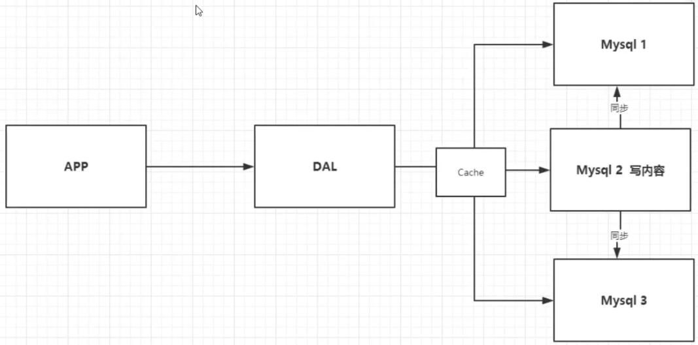


> 分库分表 + 水平拆分 + MySQL集群

本质：数据库（读，写）

**MyISAM**：表锁，影响效率！高并发下出现严重的锁问题。

**Innodb**：行锁

慢慢的开始使用分库分表来解决写的压力。

MySQL集群在当时基本解决了所有需求。

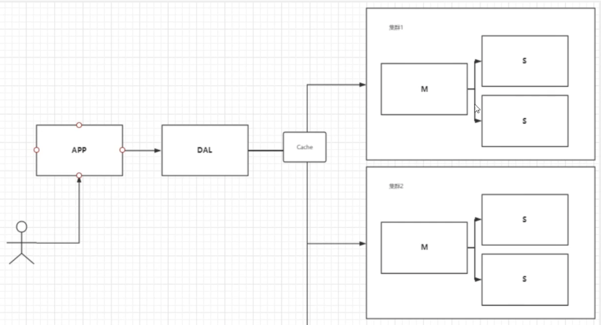


> 如今

定位、音乐、热榜！MySQL等关系型数据库不够用了！数据量很多，变化很快！

MySQL 有的使用它来存储一些比较大的文件、博客、图片！数据库表很大，效率就很低！如果有一种数据库来专门处理这种数据，MySQL的压力就变得十分小。

**===>** 研究如果处理这些问题！


目前一个基本的互联网项目！

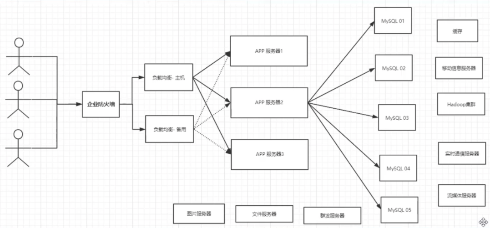


> 为什么要用NoSQL？

用户的个人信息、社交网络、地理位置，用户自己产生的数据，用户日志等等爆发式增长！

需要NoSQL数据库，可以很好处理以上情况！


### 1.2 What is NoSQL？

> NoSQL

NoSQL = Not Only SQL


泛指非关系型数据库。传统的关系型数据库无法应对web2.0时代，尤其是超大规模的高并发的社区。NoSQL在大数据时代发展迅速，Redis是发展对快的。


很多数据类型，用户的个人信息、社交网络、地理位置。这些数据类型的存储不需要一个固定的格式，不需要多余的操作就可以横向扩展！

> NoSQL特点

1. 方便扩展（数据之间没有关系，容易扩展）

2. 大数据量高性能（Redis一秒读写8万次，NoSQL的缓存记录级，细粒度缓存，性能高！）

3. 数据类型多样（不需要事先设计数据库）

4. 传统 RDMS 和 NoSQL 的区别

   **传统的 RDMS**

- - 结构化组织
  - SQL
  - 数据和关系都存在单独的表中
  - 数据操作、定义的语言9
  - 严格的一致性
  - 基础的事务
  - ...
  - **NoSQL**

- - 不仅仅是数据
  - 没有固定的查询语言
  - 键值对存储，列存储，文档存储，图形数据库（社交关系）
  - 最终一致性
  - CAP定理 和 BASE理论 （异地多活）
  - 高性能、高可用、高可扩展
  - ...


> 3V + 3高

大数据时代的3V：主要是描述问题

1. 海量 Volume
2. 多样 Variety
3. 实时 Velocity


大数据时代的3高：主要是对程序的要求

1. 高并发
2. 高可拓（随时水平拆分）
3. 高性能


### 1.3 阿里巴巴演进分析

```bash
# 1、商品的基本信息
		名称、价格、商家信息
		关系型数据库足以！ MySQL / Oracle（淘宝早年就去IOE了）
		
# 2、商品的描述、评论（文字比较多）
		文档型数据库中：MongoDB

# 3、图片
		分布式文件系统：FastDFS
		- 淘宝的 TFS
		- Google 的 GFS
		- Hadoop 的 HDFS
		- 阿里云的 OSS

# 4、商品的关键字（搜索）
		- 搜索引擎  solr  elasticsearch
		- 淘宝 的 ISearch
		
# 5、商品热门的波动信息
		- 内存数据库
		- Redis、Tair、Memcache
		
# 6、商品的交易、外部的支付宝
		- 第三方应用
```


**大型互联网应用问题：**

- 数据类型太多
- 数据源繁多，经常重构
- 数据要改造，大面积改造


**解决问题：**

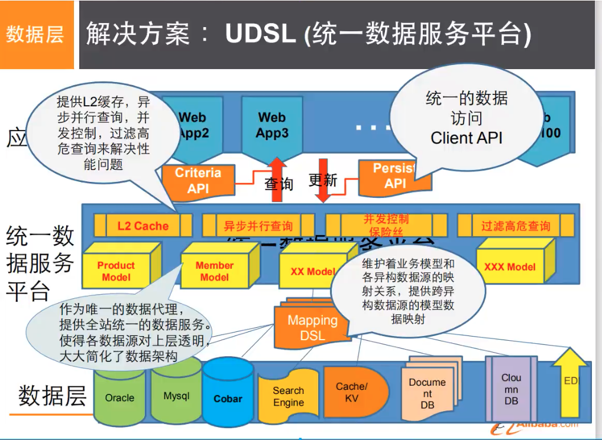

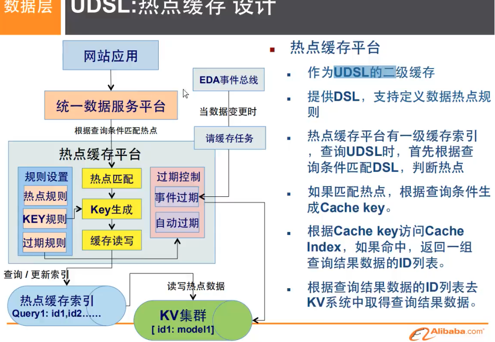


### 1.4 NoSQL的四大分类

**KV键值对：**

- 新浪：Redis
- 美团：Redis + Tair
- 阿里、百度：Redis + memcache


**文档型数据库（BSON格式，和JSON一样）**

- MongoDB

- - 基于分布式文件存储的数据库，主要用来处理大量的文档！
  - MongoDB是介于关系型数据库和非关系型数据库中间的产品！

- ConthDB


**列存储数据库**

- HBase
- 分布式文件系统


**图关系数据库**

- Neo4j，InfoGrid


### 1.5 NoSQL四大分类对比


------

## 2 Redis入门


### 2.1 概述

> Redis是什么？

Redis（Remote Dictionary Server），即远程字典服务。

Redis是一个开源的ANSI *C语言*编写、支持网络，可基于内存、可持久化的日志型、键值对数据库，并提供多种语言的API。

Redis免费+开源！是当下最热门的Nosql技术之一！也被人们称之为结构化数据库！

*Redis是NoSQL数据库的一种，都是非关系型数据库！*

> Redis能做什么？

1. 内存存储、持久化，内存中是断电即失，所以持久化很重要（RDB，AOF）
2. 效率高，可以用于高速缓存
3. 发布订阅系统
4. 地图信息分析
5. 计时器、计数器（浏览量）
6. ...

> Redis的特性

1. 多样的数据类型
2. 持久化
3. 集群
4. 事务
5. ...

> 学习网站

1. 官网：https://redis.io/

2. 中文网：http://www.redis.cn/

3. 官网下载

   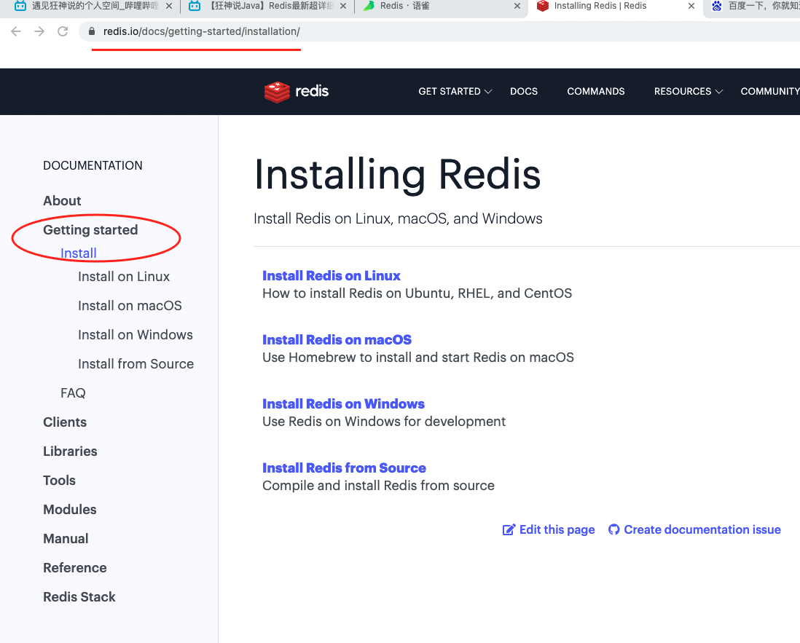

**注意：windows在github上下载（停更很久了）**

**Redis推荐都是在Linux服务器上搭建的，我们基于Linux学习——mac电脑**


### 2.2 Windows安装

#### 2.2.1 安装

1. 下载地址：https://github.com/dmajkic/redis/...   (安装包链接经常改变，进入官网仔细寻找。此时我找到的位置如下：https://github.com/dmajkic/redis/tags)
   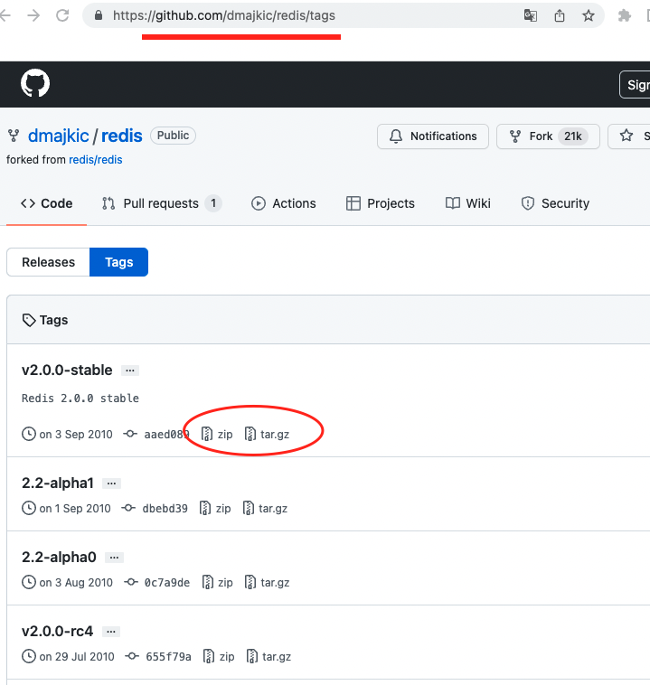

2. 下载完毕得到压缩
3. 解压到环境目录下即可

#### 2.2.2 启动

2. 开启Redis，双击运行 `redis-server.exe`
3. 使用Redis客户端 `redis-cli.exe` 来连接Redis
4. 输入 `ping` 显示 `PONG`，则连接成功


### 2.3 Linux安装及使用?

#### 2.3.1 安装

> 方式1：docker安装

使用docker安装redis镜像

```shell
docker pull redis         # 下载最新版本
docker pull redis:6.2.6   # 下载版本6.2.6
```

> 方式2：手动安装

1. 官网下载 https://download.redis.io/releases/  `redis-6.2.6.tar.gz  `

2. 解压Redis安装包，并放到全局环境目录下`/Users/hillking/Environment/redis-6.2.6`。?

3. 进入目录，可以看到Redis的配置文件`redis.conf`

4. 基本环境安装：终端进入`redis-6.2.6`目录，然后安装基本环境gcc

   ```bash
   yum install gcc-c++
   make
   make install # 安装确认
   ```

5. redis默认安装路径 `/usr/local/bin`


#### 2.3.2 启动

**默认的启动：**

默认的启动方式依赖于原始配置文件redis.conf，配置文件中默认非后台启动服务。

此时默认的启动命令有：

```shell
redis-server
......
```

**自定义启动：**

可以修改redis配置文件使其后台启动。修改配置文件及启动的过程如下：

1. 将Redis配置文件复制到安装目录下

   ```shell
   # 进入redis的安装目录bin
   cd /...安装路径/bin 
   # 在bin目录下创建一个新的目录kconfig用于存储redis.conf的复制文件
   mkdir kconfig
   # 将原始配置文件复制到新创建的../bin/kconfig中，用于之后的自定义修改而不损伤原始文件
   cp /opt/redis-6.2.6/redis.conf kconfig
   ```

2. Redis默认不是后台启动的，修改新创建的配置文件使redis后台启动

   ```shell
   # 将../bin/kconfig中的 daemonize no 改成 daemonize yes。然后保存
   daemonize yes
   ```

3. 使用修改后的配置文件启动Redis服务！

   ```shell
   # 命令行进入redis安装目录bin
   # 然后使用 redis-server kconfig/redis.conf 来在后台启动指定配置文件的redis
   cd ..redis../bin
   redis-server kconfig/redis.conf
   ```

4. 使用Redis客户端连接测试

   ```shell
   redis-cli -p 6379
   set name sugar
   get name
   keys *
   ```

5. 查看Redis进程是否开启

   ```
   ps -ef|grep redis
   ```

6. 关闭Redis服务

   ```shell
   客户端连接后
   shutdown
   exit
   ```


**注**：出现（error）NOAUTH Authentication required.

认证问题，因为设置了认证密码。 `auth "password"`


### 2.4 Macos安装及使用

#### 2.4.1 安装

> 方式1：docker安装

......

> 方式2：homebrew安装

- 首先在mac上安装homebrew： https://blog.csdn.net/realize_dream/article/details/106227622

  ```bash
  # 查看homebrew安装路径：
  (base) hillking@fengwennideMacBook-Pro opt % brew config |grep HOMEBREW
  HOMEBREW_VERSION: 3.4.4
  HOMEBREW_PREFIX: /opt/homebrew
  HOMEBREW_CASK_OPTS: []
  HOMEBREW_CORE_GIT_REMOTE: https://github.com/Homebrew/homebrew-core
  HOMEBREW_MAKE_JOBS: 10
  ```

- 然后使用brew安装redis

  ```bash
  brew install redis
  ```

  brew默认安装在根目录的隐藏路径opt中，

  redis默认安装在/opt/homebrew/Cellar/redis中。查看redis安装路径：

  ```sh
  (base) hillking@fengwennideMacBook-Pro opt % brew list redis
  /opt/homebrew/Cellar/redis/6.2.6/.bottle/etc/ (2 files)
  /opt/homebrew/Cellar/redis/6.2.6/bin/redis-benchmark
  /opt/homebrew/Cellar/redis/6.2.6/bin/redis-check-aof
  /opt/homebrew/Cellar/redis/6.2.6/bin/redis-check-rdb
  /opt/homebrew/Cellar/redis/6.2.6/bin/redis-cli
  /opt/homebrew/Cellar/redis/6.2.6/bin/redis-sentinel
  /opt/homebrew/Cellar/redis/6.2.6/bin/redis-server
  /opt/homebrew/Cellar/redis/6.2.6/homebrew.mxcl.redis.plist
  /opt/homebrew/Cellar/redis/6.2.6/homebrew.redis.service
  ```


#### 2.4.2 启动与停止

> 方式1：brew

以默认的配置文件，brew命令启动与停止redis服务：

```shell
# 启动
brew services start redis # 服务端启动后作为守护进程，关闭终端窗口不停止
redis-cli                 # 服务端启动后，启动redis客户端
brew services stop redis  # 关闭redis服务后端进程
```

测试：

```shell
=======================终端窗口1=======================
# 1、启动redis服务端守护进程
(base) hillking@fengwennideMacBook-Pro ~ % brew services start redis
==> Successfully started `redis` (label: homebrew.mxcl.redis)
# 2、启动redis客户端进程
(base) hillking@fengwennideMacBook-Pro ~ % redis-cli
127.0.0.1:6379> ping   # 测试redis是否可用
PONG

=======================终端窗口2=======================
# 3、此时关闭redis服务端守护进程
(base) hillking@fengwennideMacBook-Pro ~ % brew services stop redis
Stopping `redis`... (might take a while)
==> Successfully stopped `redis` (label: homebrew.mxcl.redis)

=======================终端窗口1=======================
# 4、重新在窗口1中验证redis是否可以用,发现redis-cli用不了了
127.0.0.1:6379> ping
Error: Server closed the connection
```

> 方式2：redis-server 默认配置启动与停止

可以在终端任意位置，使用默认的redis配置文件启动redis服务：`redis-server`命令。

此时redis-cli停止，则redis-server也会停止。

```shell
# 1、启动redis-server
(base) hillking@fengwennideMacBook-Pro ~ % redis-server
24915:C 31 Mar 2022 16:59:16.647 # oO0OoO0OoO0Oo Redis is starting oO0OoO0OoO0Oo
24915:C 31 Mar 2022 16:59:16.647 # Redis version=6.2.6, bits=64, commit=00000000, modified=0, pid=24915, just started
24915:C 31 Mar 2022 16:59:16.647 # Warning: no config file specified, using the default config. In order to specify a config file use redis-server /path/to/redis.conf
24915:M 31 Mar 2022 16:59:16.647 * Increased maximum number of open files to 10032 (it was originally set to 2560).
24915:M 31 Mar 2022 16:59:16.647 * monotonic clock: POSIX clock_gettime
                _._                                                  
           _.-``__ ''-._                                             
      _.-``    `.  `_.  ''-._           Redis 6.2.6 (00000000/0) 64 bit
  .-`` .-```.  ```\/    _.,_ ''-._                                  
 (    '      ,       .-`  | `,    )     Running in standalone mode
 |`-._`-...-` __...-.``-._|'` _.-'|     Port: 6379
 |    `-._   `._    /     _.-'    |     PID: 24915
  `-._    `-._  `-./  _.-'    _.-'                                   
 |`-._`-._    `-.__.-'    _.-'_.-'|                                  
 |    `-._`-._        _.-'_.-'    |           https://redis.io       
  `-._    `-._`-.__.-'_.-'    _.-'                                   
 |`-._`-._    `-.__.-'    _.-'_.-'|                                  
 |    `-._`-._        _.-'_.-'    |                                  
  `-._    `-._`-.__.-'_.-'    _.-'                                   
      `-._    `-.__.-'    _.-'                                       
          `-._        _.-'                                           
              `-.__.-'                                               
.....

# 2、然后启动redis-cli
(base) hillking@fengwennideMacBook-Pro ~ % redis-cli     
127.0.0.1:6379> ping
PONG

# 3、如果关闭redis-cli，则redis-server也会关闭
===============================
# 在窗口2关闭cli
(base) hillking@fengwennideMacBook-Pro ~ % redis-cli     
127.0.0.1:6379> ping
PONG
127.0.0.1:6379> shutdown
not connected>exit

===============================
# 会发现窗口1的server也停止了
.....
24915:M 31 Mar 2022 16:59:16.649 * DB loaded from disk: 0.000 seconds
24915:M 31 Mar 2022 16:59:16.649 * Ready to accept connections
24915:M 31 Mar 2022 17:02:21.026 # User requested shutdown...
24915:M 31 Mar 2022 17:02:21.026 * Saving the final RDB snapshot before exiting.
24915:M 31 Mar 2022 17:02:21.028 * DB saved on disk
24915:M 31 Mar 2022 17:02:21.028 # Redis is now ready to exit, bye bye...
(base) hillking@fengwennideMacBook-Pro ~ % 
===============================
```


> 方式3：修改配置文件自定义启动

可以将redis设置成后端启动，将其变成一个守护进程。启动时通过自定义的配置文件启动：

- 此时需要修改配置文件，类似2.3.2节：将`/opt/homebrew/Cellar/redis/6.2.6/.bottle/etc/redis.conf`文件复制到`bin`目录下，创建`kconfig/redis.conf`，然后修改文件中的`daemonize yes`。

- 接下来可以启动redis后台服务：

  ```bash
  # 1、进入redis自定义配置文件的父级目录
  (base) hillking@fengwennideMacBook-Pro bin % pwd
  /opt/homebrew/Cellar/redis/6.2.6/bin
  # 2、使用’redis-server 配置文件‘的方式在后台启动redis服务
  (base) hillking@fengwennideMacBook-Pro bin % redis-server kconfig/redis.conf
  (base) hillking@fengwennideMacBook-Pro bin % 
  ```

- 使用客户端连接对应的端口，然后测试使用

  ```shell
  # redis-cli -h 127.0.0.1 -p 6379  或者下面的命令
  (base) hillking@fengwennideMacBook-Pro bin % redis-cli -p 6379
  127.0.0.1:6379> ping
  PONG
  127.0.0.1:6379> set name nini
  OK
  127.0.0.1:6379> get name
  "nini"
  ```

- 查看redis服务进程

  ```bash
  (base) hillking@fengwennideMacBook-Pro ~ % ps -ef | grep redis
    501 26036     1   0  2:05下午 ??         0:02.31 redis-server 127.0.0.1:6379 
    501 26069 24203   0  2:09下午 ttys000    0:00.02 redis-cli -p 6379
    501 26102 24404   0  2:12下午 ttys001    0:00.00 grep redis
  ```

- 关闭redis服务

  ```bash
  # 在客户端窗口输入shutdown结束服务，输入exit退出。之后redis前后端都关闭了
  127.0.0.1:6379> shutdown
  not connected> exit
  ```

  


### 2.5 性能测试

**redis-benchmark**是一个压力测试工具。

官方自带的性能测试工具

```bash
# 测试：100个并发连接，100000个请求
redis-benchmark -h localhost -p 6379 -c 100 -n 100000
```


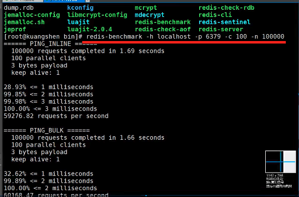


### 2.6 基础知识

> 1. Redis默认有16个数据库(redis.conf中默认声明)，默认使用第 0 个数据库，可以使用 `select` 进行切换。

查看`redis.conf`中的数据库个数：

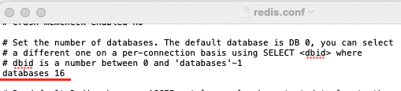

对数据库的常用操作如下：

```bash
(base) hillking@fengwennideMacBook-Pro / % redis-cli -p 6379   # 启动redis客户端
127.0.0.1:6379> select 3          # select切换到数据库3
OK
127.0.0.1:6379[3]> dbsize         # 查看数据库大小
(integer) 0
127.0.0.1:6379[3]> set name nini  # set一个键值对
OK
127.0.0.1:6379[3]> dbsize         # 查看数据库大小，此时变成了1
(integer) 1
127.0.0.1:6379[3]> select 7       # 切换到数据库7
OK
127.0.0.1:6379[7]> dbsize         # 空数据库，大小为0
(integer) 0 
127.0.0.1:6379[7]> get name       # 获取name对应的值，没有查到
(nil)
127.0.0.1:6379[7]> select 3       # 重新切换到数据库3
OK
127.0.0.1:6379[3]> get name       # 可以获取到name的值
"nini"
127.0.0.1:6379[3]> keys *         # 获取所有的key
1) "name"
127.0.0.1:6379[3]> flushdb        # 清空当前数据库
OK
127.0.0.1:6379[3]> keys *       
(empty array)
127.0.0.1:6379[3]> flushall       # 清空全部数据库
OK
```

> 2. Redis是单线程的！（最新版本6.0以上为多线程）

redis速度很快。Redis是基于内存操作的，CPU不是Redis的性能瓶颈，而是根据机器的内存和网络带宽。redis使用了单线程。

Redis是C语言写的，达到100000+的QPS，不比Memcache差

**Redis为什么单线程还这么快？**

1. 误区1：高性能的服务器一定是多线程的？
2. 误区2：多线程（CPU上下文会切换 ）一定比单线程效率高？


**核心：Redis是将所有的数据全部放在内存中的，所以使用单线程操作效率就是最高的，多线程（CPU上下文切换，耗时操作！），对于内存系统，没有上下文切换效率就是最高的！多次读写都是在一个CPU上的，在内存情况下，这个就是最佳的方案。**


------

## 3 五大数据类型

**常用API在Redis官方文档中都有！** 

- https://redis.io/docs/

**中文网站中对redis的介绍：**

- http://redis.cn/

- Redis 是一个开源（BSD许可）的，内存中的数据结构存储系统，它可以用作*数据库*、*缓存*和*消息中间件*。 它支持多种类型的数据结构，如 [字符串（strings）](http://redis.cn/topics/data-types-intro.html#strings)， [散列（hashes）](http://redis.cn/topics/data-types-intro.html#hashes)， [列表（lists）](http://redis.cn/topics/data-types-intro.html#lists)， [集合（sets）](http://redis.cn/topics/data-types-intro.html#sets)， [有序集合（sorted sets）](http://redis.cn/topics/data-types-intro.html#sorted-sets) 与范围查询， [bitmaps](http://redis.cn/topics/data-types-intro.html#bitmaps)， [hyperloglogs](http://redis.cn/topics/data-types-intro.html#hyperloglogs) 和 [地理空间（geospatial）](http://redis.cn/commands/geoadd.html) 索引半径查询。 Redis 内置了 [复制（replication）](http://redis.cn/topics/replication.html)，[LUA脚本（Lua scripting）](http://redis.cn/commands/eval.html)， [LRU驱动事件（LRU eviction）](http://redis.cn/topics/lru-cache.html)，[事务（transactions）](http://redis.cn/topics/transactions.html) 和不同级别的 [磁盘持久化（persistence）](http://redis.cn/topics/persistence.html)， 并通过 [Redis哨兵（Sentinel）](http://redis.cn/topics/sentinel.html)和自动 [分区（Cluster）](http://redis.cn/topics/cluster-tutorial.html)提供高可用性（high availability）。

**下面讲的而所有命令都要记住，之后使用springboot、jedis等，所有的方法就是这些命令！**


**redis命令不区分大小写，值区分大小写**


### 3.1 Redis-Key

> 实践验证

准备工作：

```shell
# 首先启动redis服务器，然后连接redis客户端，清空所有数据库
(base) hillking@fengwennideMacBook-Pro bin % redis-server kconfig/redis.conf
(base) hillking@fengwennideMacBook-Pro bin % redis-cli -p 6379
127.0.0.1:6379> flushall
OK
127.0.0.1:6379> keys *
(empty array)
```

测试验证：

```bash
127.0.0.1:6379> set name nini   # 设置key-value
OK
127.0.0.1:6379> get name        # 根据key获取某个value
"nini"
127.0.0.1:6379> keys *          # 查看所有的key
1) "name"
127.0.0.1:6379> exists name     # 查看某个key是否存在，存在为1，否则为0
(integer) 1
127.0.0.1:6379> Exists name1
(integer) 0
127.0.0.1:6379> move name 1     # 将key=name移动到数据库1中
(integer) 1


127.0.0.1:6379> set name nini  
OK
127.0.0.1:6379> expire name 10  # 设置key=name在10秒后过期
(integer) 1
127.0.0.1:6379> ttl name        # 查看剩余过期时间：还有4秒
(integer) 4
127.0.0.1:6379> ttl name        # 查看剩余过期时间：-2表示已经过期了
(integer) -2
127.0.0.1:6379> keys *          # 过期后查看key：name，发现没有了！
(empty array)


127.0.0.1:6379> set name nini
OK
127.0.0.1:6379> keys *
1) "name"
127.0.0.1:6379> del name        # 删除某个key
(integer) 1
127.0.0.1:6379> keys *
(empty array)


127.0.0.1:6379> set name nini
OK
127.0.0.1:6379> type name       # 查看数据类型
string
```


### 3.2 String（字符串）


String类似的使用场景：value除了是字符串，还可以是数字


- 计数器
- 统计数
- 粉丝数
- 对象缓存


```bash
127.0.0.1:6379> set name nini
OK
127.0.0.1:6379> append name "nini"  # 对存在的key追加字符串，返回字符串长度。key不存在相当于set
(integer) 8
127.0.0.1:6379> get name
"nininini"
127.0.0.1:6379> keys *
1) "name"
127.0.0.1:6379> append key1 'hello'
(integer) 5
127.0.0.1:6379> keys *
1) "key1"
2) "name"
127.0.0.1:6379> strlen name         # 获取字符串的长度
(integer) 8

#############################################################################  

# 自增自减，步长
127.0.0.1:6379> set views 0         # 初始浏览量为0(自定义初始值)
OK
127.0.0.1:6379> incr views          # 自增1
(integer) 1
127.0.0.1:6379> get views
"1"
127.0.0.1:6379> decr views          # 自减1
(integer) 0
127.0.0.1:6379> incrby views 10     # 设置步长10，自增10
(integer) 10
127.0.0.1:6379> decrby views 5      # 设置自减步长5
(integer) 5
127.0.0.1:6379> get views      
"5"

#############################################################################


# 字符串范围 getrange
127.0.0.1:6379> set key1 "hello,sugar"
OK
127.0.0.1:6379> getrange key1 0 3   # 截取第0位到第3位子串
"hell"
127.0.0.1:6379> getrange key1 0 -1  # 截取第0位到最后一位
"hello,nini"

# 替换
127.0.0.1:6379> set key2 abcdefg
OK
127.0.0.1:6379> setrange key2 1 xx  # 替换指定位置开始的字符串
(integer) 7
127.0.0.1:6379> get key2
"axxdefg"

#############################################################################

# setex (set with expire)   # 设置过期时间
# setnx (set if not exist)  # 不存在时设置（在分布式锁中常用）

127.0.0.1:6379> setex key3 30 "hello"  # 设置key3的值为hello，30秒后过期
OK
127.0.0.1:6379> ttl key3    # 查看剩余有效时间  
(integer) 27

127.0.0.1:6379> setnx mykey "redis"  # 当mykey不存在时，创建成功
(integer) 1
127.0.0.1:6379> setnx mykey "mysql"  # 当mykey存在时，创建失败
(integer) 0
127.0.0.1:6379> get mykey            # 查看发现mysql是旧的值
"redis"

#############################################################################

# mset  # 批量设置
# msetnx  # 不存在时批量设置：这是一个原子操作，要么都成功要么都失败
# mget  # 批量获取
127.0.0.1:6379> mset k1 v1 k2 v2 k3 v3  # 批量设置键值对
OK
127.0.0.1:6379> keys *
1) "k2"
2) "k1"
3) "k3"
127.0.0.1:6379> mget k1 k2 k3           # 同时获取多个值
1) "v1"
2) "v2"
3) "v3"
127.0.0.1:6379>  msetnx k1 v1 k4 v4     # k1存在，k4不存在。原子操作所以都失败
(integer) 0
127.0.0.1:6379> get k4
(nil)

# 对象
set user:1 {name:sugar, age:3}  # 设置一个user:1 对象，值为JSON字符串保存
# 这里的key是巧妙设置：  user:{id}:{field}
127.0.0.1:6379> mset user:1:name sugar user:1:age 2
OK
127.0.0.1:6379> mget user:1:name user:1:age
1) "sugar"
2) "2"

############################################################################# 

# getset  # 先get再set
127.0.0.1:6379> getset db redis  # 如果不存在值，则返回nil
(nil)
127.0.0.1:6379> get db
"redis"
127.0.0.1:6379> getset db mongodb  # 如果存在值，获取原来的值，并设置新的值
"redis"
127.0.0.1:6379> get db
"mongodb"
```


### 3.3 List

基本的数据类型，列表。

在Redis中，可以将List实现为栈、队列、阻塞队列。

所有的List命令都是 `l` 开头的。


**小结**

- 列表实际上是一个链表，node的left和right都可以插入值
- 如果 key 不存在，创建新的链表
- 如果 key 存在，新增内容
- 如果移除了所有值（空链表），也代表不存在
- 在两边插入或者改动值，效率最高！中间元素，相对来说效率会低一点！


**应用：**消息队列（Lpush  Rpop）、栈（Lpush  Lpop）


```bash
#############################################################################

# lpush 左添加
# rpush 右添加
127.0.0.1:6379> lpush list one    # 将一个或多个值插入列表的头部
(integer) 1
127.0.0.1:6379> lpush list two
(integer) 2
127.0.0.1:6379> lpush list three
(integer) 3
127.0.0.1:6379> lrange list 0 -1  # 获取List中所有值, 没有rrange命令
1) "three"
2) "two"
3) "one"
127.0.0.1:6379> lrange list 0 1   # 获取List中具体的值
1) "three"
2) "two"
127.0.0.1:6379> rpush list right  # 将一个或多个值插入列表的尾部：可做双端队列
(integer) 4
127.0.0.1:6379> lrange list 0 -1  
1) "three"
2) "two"
3) "one"
4) "right"

#############################################################################

# lpop 左移除
# rpop 右移除
127.0.0.1:6379> lrange list 0 -1  
1) "three"
2) "two"
3) "one"
4) "right"
127.0.0.1:6379> lpop list  # 移除列表头部元素
"three"
127.0.0.1:6379> rpop list  # 移除列表尾部元素 
"right"
127.0.0.1:6379> lrange list 0 -1
1) "two"
2) "one"

#############################################################################

# lindex  # 通过下标获取list中的某个值
127.0.0.1:6379> lrange list 0 -1
1) "two"
2) "one"
127.0.0.1:6379> lindex list 0  # 通过下标获取List中的某一个值
"two"
127.0.0.1:6379> lindex list 5
(nil)

#############################################################################

# llen  # 获取长度
127.0.0.1:6379> llen list  # 获取列表的长度
(integer) 3

#############################################################################

# lrem  # 移除指定的值，精确匹配
# 注意： lrem key count value 表示从list中移除count个value
# count > 0：从表头开始移除value
# count < 0：从表尾开始移除value
# count = 0：移除所有的value
127.0.0.1:6379> lrange list 0 -1
1) "three"
2) "three"
3) "two"
4) "one"
127.0.0.1:6379> lrem list 1 one  # 移除List中1个one(1>0,从表头开始移除；)
(integer) 1
127.0.0.1:6379> lrange list 0 -1
1) "three"
2) "three"
3) "two"

#############################################################################

# ltrim    # 截取List中的元素
127.0.0.1:6379> rpush list "hello"
(integer) 1
127.0.0.1:6379> rpush list "hello1"
(integer) 2
127.0.0.1:6379> rpush list "hello2"
(integer) 3
127.0.0.1:6379> rpush list "hello3"
(integer) 4
127.0.0.1:6379> lrange list 0 -1  
1) "hello"
2) "hello1"
3) "hello2"
4) "hello3"
127.0.0.1:6379> ltrim list 1 2  # 通过下标，截取指定长度的元素.列表被改变
OK
127.0.0.1:6379> lrange list 0 -1
1) "hello1"
2) "hello2"

#############################################################################

# rpoplpush  # 移除列表的最后一个元素，并移动到另一个列表的尾部（可以是当前列表）
127.0.0.1:6379> rpush list "hello"
(integer) 1
127.0.0.1:6379> rpush list "hello1"
(integer) 2
127.0.0.1:6379> rpush list "hello2"
(integer) 3
127.0.0.1:6379> lrange list 0 -1
1) "hello"
2) "hello1"
3) "hello2"
127.0.0.1:6379> rpoplpush list otherlist  # 右移除列表元素，左添加到另一列表中
"hello2"
127.0.0.1:6379> lrange list 0 -1  # 原列表元素已被移除
1) "hello"
2) "hello1"
127.0.0.1:6379> lrange otherlist 0 -1  # 不存在的列表则会创建
1) "hello2"

#############################################################################

# lset  # 将列表中指定下标的值替换为另一个值
127.0.0.1:6379> exists list       # 判断列表是否存在
(integer) 0
127.0.0.1:6379> lset list 0 item  # 如果不存在列表，更新会报错
(error) ERR no such key
127.0.0.1:6379> lpush list value1 # 创建list列表
(integer) 1
127.0.0.1:6379> lrange list 0 -1
1) "value1"
127.0.0.1:6379> lset list 0 item  # 如果存在，更新下标0的值
OK
127.0.0.1:6379> lrange list 0 -1
1) "item"
127.0.0.1:6379> lset list 1 other  # 如果不存在，则会报错
(error) ERR index out of range

#############################################################################

# linsert  # 将某个具体的value插入到列表中某个元素的前面或者后面
# 注意：linsert key before|after value1 value2
# 在列表key中value1第一次出现的前面|后面插入value2
127.0.0.1:6379> rpush list "hello"
(integer) 1
127.0.0.1:6379> rpush list "world"
(integer) 2
127.0.0.1:6379> linsert list before "world" "other"  # 在某个元素前面插入值
(integer) 3
127.0.0.1:6379> lrange list 0 -1
1) "hello"
2) "other"
3) "world"
127.0.0.1:6379> linsert list after "world" new  # 在某个元素后面插入值
(integer) 4
127.0.0.1:6379> lrange list 0 -1
1) "hello"
2) "other"
3) "world"
4) "new"
```


### 3.4 Set（集合）

Set是**无序不重复**集合。

```bash
#############################################################################

# sadd 添加元素（已经存在的元素不能重复添加）
# smembers 查看元集合中的元素
# sismember 判断元素是否在集合中
127.0.0.1:6379> sadd myset "hello"  # 添加元素
(integer) 1
127.0.0.1:6379> sadd myset "sugar"  
(integer) 1
127.0.0.1:6379> sadd myset "sugar"  # 不能添加重复的元素
(integer) 0
127.0.0.1:6379> sadd myset "heihei"
(integer) 1
127.0.0.1:6379> smembers myset  # 查看指定set的所有元素
1) "sugar"
2) "hello"
3) "heihei"
127.0.0.1:6379> sismember myset hello  # 判断元素hello是否在myset中
(integer) 1
127.0.0.1:6379> sismember myset world  # 存在返回1，不存在返回0 
(integer) 0

#############################################################################

# scard  获取set集合中元素的个数
127.0.0.1:6379> scard myset 
(integer) 3

#############################################################################

# srem 删除某个元素
127.0.0.1:6379> srem myset hello  # 删除myset中的元素hello
(integer) 1
127.0.0.1:6379> scard myset
(integer) 2
127.0.0.1:6379> smembers myset
1) "sugar"
2) "heihei"

#############################################################################
# srandmember 随机抽取元素
127.0.0.1:6379> srandmember myset  # 随机抽取一个元素
"heihei"
127.0.0.1:6379> srandmember myset 2  # 随机抽取指定个数元素
1) "sugar"
2) "heihei"
#############################################################################

# spop 随机删除key
127.0.0.1:6379> smembers myset
1) "sugar"
2) "hello"
3) "heihei"
127.0.0.1:6379> spop myset  # 随机删除一个元素
"sugar"
127.0.0.1:6379> spop myset
"heihei"
127.0.0.1:6379> smembers myset
1) "hello"

#############################################################################

# smove 将一个set中指定的key移动到另外一个set中
127.0.0.1:6379> smove myset myset2 sugar  # 将myset中的元素suger移动到myset2中
(integer) 1
127.0.0.1:6379> smembers myset
1) "hello"
2) "world"
127.0.0.1:6379> smembers myset2
1) "sugar"
2) "set2"

#############################################################################

# 微博中共同关注、二度好友等功能的实现（并集）
# 数字集合类：
# sdiff：差集
# sinter：交集
# sunion：并集
127.0.0.1:6379> sadd key1 a b c
(integer) 3
127.0.0.1:6379> sadd key2 c d e
(integer) 3
127.0.0.1:6379> sdiff key1 key2  # 返回key1中与key2不同的元素 
1) "a"
2) "b"
127.0.0.1:6379> sinter key1 key2  # 交集
1) "c"
127.0.0.1:6379> sunion key1 key2  # 并集
1) "c"
2) "e"
3) "a"
4) "b"
5) "d"
```


#### 3.5 Hash（哈希）

Map集合，key-Map集合！本质和String类型没有太大区别，还是简单的 key-value。

Hash可以存user对象的name、age，用户信息之类的，尤其是经常变动的信息。

```bash
#############################################################################

# hset：添加key-map集合
# hget：获取key对应的map中的某个键
# hmset：批量添加map键值对
# hmget：批量获取map值
# hgetall：获取key对应的map中的全部键值对
127.0.0.1:6379> hset myhash field1 sugar  # 在myhash中添加一个键值对
(integer) 0
127.0.0.1:6379> hget myhash field1  # 获取一个字段值
"sugar"
127.0.0.1:6379> hmset myhash field1 hello field2 world  # 添加多个key-value
OK
127.0.0.1:6379> hmget myhash field1 field2  # 获取多个字段值
1) "hello"
2) "world"
127.0.0.1:6379> hgetall myhash  # 获取全部数据，以键值形式展示
1) "field1"
2) "hello"
3) "field2"
4) "world"

#############################################################################

# hdel 删除指定的字段
127.0.0.1:6379> hdel myhash field1  # 删除指定字段
(integer) 1
127.0.0.1:6379> hgetall myhash
1) "field2"
2) "world"

#############################################################################
# hlen  # 获取key的长度
127.0.0.1:6379> hlen myhash  # 获取哈希长度
(integer) 1
#############################################################################
# hexists 
127.0.0.1:6379> hexists myhash field1  # 判断指定字段是否存在
(integer) 0
127.0.0.1:6379> hexists myhash field2
(integer) 1
#############################################################################
# 只获取所有field
# 只获取所有vale
127.0.0.1:6379> hkeys myhash  # 获取所有字段
1) "field2"
127.0.0.1:6379> hvals myhash  # 获取所有值
1) "world"
#############################################################################
# incr  decr  setnx
127.0.0.1:6379> hset myhash field3 5
(integer) 1
127.0.0.1:6379> hincrby myhash field3 1  # 自增
(integer) 6
127.0.0.1:6379> hincrby myhash field3 -1  # 自减
(integer) 5
127.0.0.1:6379> hsetnx myhash field4 hello  # 如果不存在则可以set
(integer) 1
127.0.0.1:6379> hsetnx myhash field4 hello
(integer) 0
```


#### 3.6 Zset（有序集合）


在Set的基础上，增加了一个值，set k1 v1，zset k1 score1 v1


案例思路：set 排序，存储班级成绩，工资表排序，带权重判断，排行榜应用实现，取TOP N...


```bash
#############################################################################
127.0.0.1:6379> zadd myset 1 one  # 添加一个值
(integer) 1
127.0.0.1:6379> zadd myset 2 two 3 three  # 添加多个值
(integer) 2
127.0.0.1:6379> zrange myset 0 -1  # 
1) "one"
2) "two"
3) "three"
#############################################################################
# 实现排序
127.0.0.1:6379> zadd salary 2500 xiaoming  # 添加三个用户
(integer) 1
127.0.0.1:6379> zadd salary 5000 zhangsan
(integer) 1
127.0.0.1:6379> zadd salary 500 wangwu
(integer) 1
127.0.0.1:6379> zrangebyscore salary -inf +inf  # 显示全部的用户，从小到大排序
1) "wangwu"
2) "xiaoming"
3) "zhangsan"
127.0.0.1:6379> zrevrange salary 0 -1  # 从大到小排序
1) "zhangsan"
2) "wangwu"
127.0.0.1:6379> zrangebyscore salary -inf +inf withscores  # 带成绩返回
1) "wangwu"
2) "500"
3) "xiaoming"
4) "2500"
5) "zhangsan"
6) "5000"
127.0.0.1:6379> zrangebyscore salary -inf 2500 withscores  # 限定scores范围
1) "wangwu"
2) "500"
3) "xiaoming"
4) "2500"
#############################################################################
# zrem
127.0.0.1:6379> zrange salary 0 -1
1) "wangwu"
2) "xiaoming"
3) "zhangsan"
127.0.0.1:6379> zrem salary xiaoming  # 移除指定元素
(integer) 1
127.0.0.1:6379> zrange salary 0 -1
1) "wangwu"
2) "zhangsan"
#############################################################################
# zcard
127.0.0.1:6379> zcard salary  # 获取元素个数
(integer) 2
#############################################################################
# 区间计算
127.0.0.1:6379> zadd myset 1 hello 2 world 3 sugar
(integer) 3
127.0.0.1:6379> zcount myset 1 3  # 获取指定区间的元素数量
(integer) 3
#############################################################################
# 获取score值
127.0.0.1:6379> zscore myset hello
(integer) 1
# 自增score值  zincrby key increment member
127.0.0.1:6379> zincrby myset 2 hello
(integer) 3
```


------

## 4 三种特殊数据类型


#### 4.1 geospatial 地理位置


案例：朋友定位、附近的人、打车距离计算


Redis 的 GEO，可以推荐地理位置的信息、两地之间的距离、方圆几公里的人。


可以查询一些测试数据：http://www.jsons.cn/lngcodeinfo/0706D99C19A781A3/


只有六个命令：


- GEOADD
- GEODIST
- GEOHASH
- GEOPOS
- GEORADIUS
- GEORADIUSBYMEMBER


##### 4.1.1 geoadd


```bash
# geoadd 添加地理位置
# 规则：地球两极无法直接添加，一般会下载城市数据通过程序直接导入
# 参数 key 值（纬度、经度、名称）
# 有效的精度从-180度到180度，有效的纬度从-85度到85度。
127.0.0.1:6379> geoadd china:city 116.40 39.90 beijing
(integer) 1
127.0.0.1:6379> geoadd china:city 121.47 31.23 shanghai
(integer) 1
127.0.0.1:6379> geoadd china:city 106.50 29.53 chognqing
(integer) 1
127.0.0.1:6379> geoadd china:city 114.05 22.52 shenzhen 120.16 30.24 hangzhou 108.96 34.26 xian
(integer) 3
```


##### 4.1.2 geopos

```bash
127.0.0.1:6379> geopos china:city beijing  # 获取指定城市的精度和纬度
1) 1) "116.39999896287918091"
   2) "39.90000009167092543"
```


##### 4.1.3 geodist

**应用****：**计算两人之间的直线距离

**单位：**

- **m** 米
- **km** 千米
- **mi** 英里
- **ft** 英尺


```bash
127.0.0.1:6379> geodist china:city beijing shanghai  # 默认单位米
"1067378.7564"
127.0.0.1:6379> geodist china:city beijing shanghai km  # 设定单位千米
"1067.3788"
```


##### 4.1.4 georadius（以给定的经纬度为中心，找出某一半径内的元素）

**应用：**附近的人？获得所有附近的人的地址定位，通过半径来查询。


```bash
127.0.0.1:6379> georadius china:city 110 30 1000 km  # 获取 110 30 这个经纬度为中心，方圆1000km内的城市
1) "chognqing"
2) "xian"
3) "shenzhen"
4) "hangzhou"
127.0.0.1:6379> georadius china:city 110 30 500 km  # 方圆500km内的城市
1) "chognqing"
2) "xian"
127.0.0.1:6379> georadius china:city 110 30 500 km withdist  # 显示到中心的直线距离
1) 1) "chognqing"
   2) "341.9374"
2) 1) "xian"
   2) "483.8340"
127.0.0.1:6379> georadius china:city 110 30 500 km withcoord  # 显示他人的定位信息
1) 1) "chognqing"
   2) 1) "106.49999767541885376"d
      2) "29.52999957900659211"
2) 1) "xian"
   2) 1) "108.96000176668167114"
      2) "34.25999964418929977"
127.0.0.1:6379> georadius china:city 110 30 500 km withdist withcoord count 1  # 显示指定数量的
1) 1) "chognqing"
   2) "341.9374"
   3) 1) "106.49999767541885376"
      2) "29.52999957900659211"
```


##### 4.1.5 georadiusbymember（以某个元素为中心做计算）

```bash
# 找出位于指定元素周围的其他元素
127.0.0.1:6379> georadiusbymember china:city beijing 1000 km
1) "beijing"
2) "xian"
127.0.0.1:6379> georadiusbymember china:city shanghai 400 km
1) "hangzhou"
2) "shanghai"
```


##### 4.1.6 geohash（返回一个或多个位置元素的geohash表示）

该命名将返回11个字符的Geohash字符串。

```bash
# 将二维的经纬度转换为一维的字符串，如果两个字符串越接近，则距离越近
127.0.0.1:6379> geohash china:city beijing chognqing  
1) "wx4fbxxfke0"
2) "wm5xzrybty0"
```


##### 4.1.7 Geo底层实现原理：Zset！可以使用Zset命令来操作Geo

```bash
# zrem 移除元素
127.0.0.1:6379> zrange china:city 0 -1
1) "chognqing"
2) "xian"
3) "shenzhen"
4) "hangzhou"
5) "shanghai"
6) "beijing"
127.0.0.1:6379> zrem china:city beijing  # 移除指定元素
(integer) 1
127.0.0.1:6379> zrange china:city 0 -1
1) "chognqing"
2) "xian"
3) "shenzhen"
4) "hangzhou"
5) "shanghai"
```


#### 4.2 hyperloglog


基数

A {1, 3, 5, 7, 8, 9, 7}

B{1, 3, 5, 7, 8}

**基数**（不重复的元素）：5，可以接收误差！


hyperloglog简介


Hyperloglog数据结构：**做基数统计的算法！**


优点：占用的内存是固定的。2^64 不同的元素的技术，只需要占用 12KB 内存。如果要从内存角度比较，Hyterlolog是首选！


**网页的 UV（一个人多次访问一个网站，但还是算作一个人！）**


传统的方式，set保存用户的id，然后就可以统计 set 中元素的数量作为标准判断！


如果保存大量的用户id，就会占用大量内存！目的是为了计数，而不是保存用户id。


0.81%的错误率！在UV统计任务中，可以忽略不计！


如果不允许容错，就使用 set 或自己的数据类型即可！


```bash
127.0.0.1:6379> pfadd mykey a b c d e f g h i j  # 创建第一组元素
(integer) 1
127.0.0.1:6379> pfcount mykey  # 统计 mykey 元素的基数数量
(integer) 10
127.0.0.1:6379> pfadd mykey2 i j z x c v b n m  
(integer) 1
127.0.0.1:6379> pfcount mykey2
(integer) 9
127.0.0.1:6379> pfmerge mykey3 mykey mykey2  # 合并两组 mykey + mykey2 => mykey3 并集
OK
127.0.0.1:6379> pfcount mykey3  # 查看并集的数量
(integer) 15
```


#### 4.3 bitmaps


位存储


统计用户信息，活跃，不活跃！登录，未登录！打卡，未打卡！两个状态的，都可以使用 Bitmaps（位图）！


都是操作二进制位来进行记录，就只有 0 和 1 两个状态！


365天 = 365bit，1 字节 = 8 bit，46个字节左右！


```bash
# 使用 bitmap 来记录周一到周日的打卡
# 构造一周的打卡记录
127.0.0.1:6379> setbit sign 0 1
(integer) 0
127.0.0.1:6379> setbit sign 1 0
(integer) 0
127.0.0.1:6379> setbit sign 2 0
(integer) 0
127.0.0.1:6379> setbit sign 3 1
(integer) 0
127.0.0.1:6379> setbit sign 4 1
(integer) 0
127.0.0.1:6379> setbit sign 5 0
(integer) 0
127.0.0.1:6379> setbit sign 6 0
(integer) 0
# 查看某一天是否有打卡
127.0.0.1:6379> getbit sign 3
(integer) 1
127.0.0.1:6379> getbit sign 6
(integer) 0
# 统计打卡的天数
127.0.0.1:6379> bitcount sign
(integer) 3
```


------

## 5 事务


要么同时成功，要么同时失败，**原子性**！


Redis事务的本质：一组命令的集合！一个事务中的所有命令都会被序列化，在事务执行过程中，会按照顺序执行！


一次性，顺序性，排他性！执行一些列的命令！


```bash
---------  队列 set set set 执行 ---------
```


Redis事务没有隔离级别的概念！


所有命令在事务中，并没有直接被执行！只有发起执行命令的时候，才会执行！ `exec命令`


Redis单条命令是保存原子性的，但是事务不保证原子性！


Redis事务流程：


- 开启事务（`multi`）
- 命令入队（...）
- 执行事务（`exec`）


正常执行事务


```bash
127.0.0.1:6379> multi  # 开启事务
OK
127.0.0.1:6379> set k1 v1  # 命令入队
QUEUED
127.0.0.1:6379> set k2 v2
QUEUED
127.0.0.1:6379> get k2
QUEUED
127.0.0.1:6379> set k3 v3
QUEUED
127.0.0.1:6379> exec  # 执行事务
1) OK
2) OK
3) "v2"
4) OK
```


放弃事务


```bash
127.0.0.1:6379> multi  # 开启事务
OK
127.0.0.1:6379> set k1 v1
QUEUED
127.0.0.1:6379> set k2 v2
QUEUED
127.0.0.1:6379> set k4 v4
QUEUED
127.0.0.1:6379> discard  # 取消事务
OK
127.0.0.1:6379> get k4  # 事务队列中的命令都不会执行
(nil)
```


编译型异常（代码有问题，命令有错！）事务中的所有命令都不会执行！


```bash
127.0.0.1:6379> multi
OK
127.0.0.1:6379> set k1 v1
QUEUED
127.0.0.1:6379> set k2 v2
QUEUED
127.0.0.1:6379> set k3 v3
QUEUED
127.0.0.1:6379> getset k3  # 错误的命令
(error) ERR wrong number of arguments for 'getset' command
127.0.0.1:6379> set k4 v4
QUEUED
127.0.0.1:6379> exec  # 执行事务报错
(error) EXECABORT Transaction discarded because of previous errors.
127.0.0.1:6379> get k4  # 所有命令都不会执行
(nil)
```


运行时异常，如果事务队列中存在语法性问题，那么执行命令的时候，其他命令可以正常执行的，错误命令抛出异常！


```bash
127.0.0.1:6379> set k1 v1
OK
127.0.0.1:6379> multi
OK
127.0.0.1:6379> incr k1
QUEUED
127.0.0.1:6379> set k2 v2
QUEUED
127.0.0.1:6379> set k3 v3
QUEUED
127.0.0.1:6379> get k3
QUEUED
127.0.0.1:6379> exec  # 虽然第一条命令报错了，但是其他命令依然执行成功，不保证整个事务的原子性
1) (error) ERR value is not an integer or out of range
2) OK
3) OK
4) "v3"
127.0.0.1:6379> get k1
"v1"
```


监控！ Watch


**悲观锁：**

- 认为什么时候都会出问题，无论做什么都会加锁！


**乐观锁：**

- 认为什么时候都不会出问题，所以不会上锁！更新数据的时候去判断一下，在此期间是否有人修改过这个数据。`通过versioin字段`
- 获取version
- 更新的时候比较version


Redis的监视测试


正常执行成功！


```bash
127.0.0.1:6379> set money 100
OK
127.0.0.1:6379> set out 0
OK
127.0.0.1:6379> watch money  # 监视 money 对象
OK
127.0.0.1:6379> multi  # 事务正常执行，数据期间没有发生变动，这个时候正常执行成功！
OK
127.0.0.1:6379> decrby money 20
QUEUED
127.0.0.1:6379> incrby out 20
QUEUED
127.0.0.1:6379> exec
1) (integer) 80
2) (integer) 20
```


测试多线程修改值，监控失败！使用 `watch` 可以当做 Redis 的**乐观锁**操作！


```bash
127.0.0.1:6379> watch money  # 监视 money 
OK
127.0.0.1:6379> multi
OK
127.0.0.1:6379> decrby money 10
QUEUED
127.0.0.1:6379> incrby out 10
QUEUED
127.0.0.1:6379> exec  # 执行之前，另外一个线程修改了值，则事务执行失败
(nil)
```


解决：重新监视，再执行


```bash
127.0.0.1:6379> unwatch  # 1. 如果发现事务执行失败，就先解锁
OK
127.0.0.1:6379> watch money  # 2. 获取最新的version，再次监视
OK
127.0.0.1:6379> multi
OK
127.0.0.1:6379> decrby money 10
QUEUED
127.0.0.1:6379> incrby money 10
QUEUED
127.0.0.1:6379> exec  # 3. 比对监视的值是否发生了变化，如果没有变化，那么执行成功，否则执行失败
1) (integer) 990
2) (integer) 1000
```


------

## 6 Jedis


使用 Java 来操作 Redis。


#### 6.1 什么是 Jedis


Redis 官方推荐的 Java 连接开发工具！使用 Java 操作 Redis 中间件，需要对 Redis十分熟悉！


测试


1. 导入对应的依赖

```xml
<dependency>
  <groupId>redis.clients</groupId>
  <artifactId>jedis</artifactId>
  <version>3.4.1</version>
</dependency>
<dependency>
  <groupId>com.alibaba</groupId>
  <artifactId>fastjson</artifactId>
  <version>1.2.73</version>
</dependency>
```

1. 编码测试

- - 连接数据库
  - 操作命令
  - 断开连接

```java
public class TestPing {
    public static void main(String[] args) {
        // 1、new Jedis
        Jedis jedis = new Jedis("localhost", 6379);
        // jedis 所有命令即 Redis所有指令
        // NOAUTH Authentication required.
        jedis.auth("123456");
        // 连接测试
        System.out.println(jedis.ping());
    }
}
```


#### 6.2 常用的API


##### 6.2.1 基本操作


```java
Jedis jedis = new Jedis("localhost", 6379);
jedis.auth("123456");

System.out.println("清空数据：" + jedis.flushDB());
System.out.println("判断某个键是否存在：" + jedis.exists("username"));
System.out.println("新增 <username, sugar> 的键值对：" + jedis.set("username", "sugar"));
System.out.println("新增 <password, 123456> 的键值对：" + jedis.set("password", "123456"));
System.out.println("系统中所有的键如下：\n " + jedis.keys("*"));
System.out.println("删除键password：" + jedis.del("password"));
System.out.println("判断键password是否存在：" + jedis.exists("password"));
System.out.println("查看键username所储值的类型：" + jedis.type("username"));
System.out.println("随机返回key空间的一个：" + jedis.randomKey());
System.out.println("重命名key：" + jedis.rename("username", "name"));
System.out.println("取出改名后的name：" + jedis.get("name"));
System.out.println("按索引查询：" + jedis.select(0));
System.out.println("删除当前选择数据库中的所有key：" + jedis.flushDB());
System.out.println("返回当前数据库中key的数量：" + jedis.dbSize());
System.out.println("删除所有数据库中的所有key：" + jedis.flushAll());
```


##### 6.2.2 String


```java
jedis.flushDB();
System.out.println("========= 增加数据 =========");
System.out.println(jedis.set("key1", "value1"));
System.out.println(jedis.set("key2", "value2"));
System.out.println(jedis.set("key3", "value3"));
System.out.println("删除键key2：" + jedis.del("key2"));
System.out.println("获取键key2：" + jedis.get("key2"));
System.out.println("修改key1：" + jedis.set("key1", "value1Changed"));
System.out.println("获取key1的值：" + jedis.get("key1"));
System.out.println("在key3后面加入值：" + jedis.append("key3", "End"));
System.out.println("获取key3的值：" + jedis.get("key3"));
System.out.println("增加多个键值对：" + jedis.mset("key01", "value01", "key02", "value02", "key03", "value03"));
System.out.println("获取多个键值对：" + jedis.mget("key01", "key02", "key03"));
System.out.println("获取多个键值对：" + jedis.mget("key01", "key02", "key03", "key04"));
System.out.println("删除多个键值对：" + jedis.del("key01", "key02"));
System.out.println("获取多个键值对：" + jedis.mget("key01", "key02", "key03"));


jedis.flushDB();
System.out.println("========= 新增键值对防止覆盖原先值 =========");
System.out.println(jedis.setnx("key1", "value1"));
System.out.println(jedis.setnx("key2", "value2"));
System.out.println(jedis.setnx("key2", "value2-new"));
System.out.println(jedis.get("key1"));
System.out.println(jedis.get("key2"));

System.out.println("========= 新增键值对并设置有效时间 =========");
System.out.println(jedis.setex("key3", 2, "value3"));
System.out.println(jedis.get("key3"));
try {
  Thread.sleep(2000);
} catch (InterruptedException e) {
  e.printStackTrace();
}
System.out.println(jedis.get("key3"));

System.out.println("========= 获取原值，更新为新值 =========");
System.out.println(jedis.getSet("key2", "key2Getset"));
System.out.println(jedis.get("key2"));

System.out.println("获取key2的子串：" + jedis.getrange("key2", 2, 4));
```


##### 6.2.3 List


```java
jedis.flushDB();

System.out.println("========= 添加一个List =========");
jedis.lpush("collections", "ArrayList", "Vector", "Stack", "HashMap", "WeakHashMap");
jedis.lpush("collections", "HashSet");
jedis.lpush("collections", "TreeSet");
jedis.lpush("collections", "TreeMap");
System.out.println("collections的内容：" + jedis.lrange("collections", 0, -1));
System.out.println("collections区间0-3的元素：" + jedis.lrange("collections", 0, 3));

System.out.println("===============================");
System.out.println("删除指定元素个数：" + jedis.lrem("collections", 2, "HashMap"));
System.out.println("collections的内容：" + jedis.lrange("collections", 0, -1));
System.out.println("删除下标0-3区间之外的元素：" + jedis.ltrim("collections", 0, 3));
System.out.println("collections的内容：" + jedis.lrange("collections", 0, -1));
System.out.println("collections列表出栈（左端）：" + jedis.lpop("collections"));
System.out.println("collections的内容：" + jedis.lrange("collections", 0, -1));
System.out.println("collections添加元素，从列表右端，与lpush相对应：" + jedis.rpush("collections", "HashMap"));
System.out.println("collections的内容：" + jedis.lrange("collections", 0, -1));
System.out.println("collections列表出栈（右端）：" + jedis.rpop("collections"));
System.out.println("collections的内容：" + jedis.lrange("collections", 0, -1));
System.out.println("修改collections指定下标为1的内容：" + jedis.lset("collections", 1, "LinkedList"));
System.out.println("collections的内容：" + jedis.lrange("collections", 0, -1));

System.out.println("===============================");
System.out.println("collections的长度：" + jedis.llen("collections"));
System.out.println("获取collections下标为2的元素：" + jedis.lindex("collections", 2));

System.out.println("===============================");
jedis.lpush("sortedList", "3", "6", "2", "0", "7", "4");
System.out.println("sortedList排序前：" + jedis.lrange("sortedList", 0, -1));
System.out.println(jedis.sort("sortedList"));
System.out.println("sortedList排序后：" + jedis.lrange("sortedList", 0, -1));
```


##### 6.2.4 Set


```java
System.out.println("======== 向集合中添加元素（不重复） ========");
System.out.println(jedis.sadd("eleSet", "e1", "e2", "e4", "e3", "e0", "e8", "e7", "e5"));
System.out.println(jedis.sadd("eleSet", "e6"));
System.out.println(jedis.sadd("eleSet", "e6"));
System.out.println("eleSet的所有元素为：" + jedis.smembers("eleSet"));
System.out.println("删除一个元素e0：" + jedis.srem("eleSet", "e0"));
System.out.println("eleSet的所有元素为：" + jedis.smembers("eleSet"));
System.out.println("删除两个元素e6和e7：" + jedis.srem("eleSet", "e7", "e6"));
System.out.println("eleSet的所有元素为：" + jedis.smembers("eleSet"));
System.out.println("随机移除集合中的一个元素：" + jedis.spop("eleSet"));
System.out.println("随机移除集合中的一个元素：" + jedis.spop("eleSet"));
System.out.println("eleSet的所有元素为：" + jedis.smembers("eleSet"));
System.out.println("eleSet中包含元素的个数：" + jedis.scard("eleSet"));
System.out.println("e3是否在eleSet中：" + jedis.sismember("eleSet", "e3"));
System.out.println("e1是否在eleSet中：" + jedis.sismember("eleSet", "e1"));
System.out.println("e5是否在eleSet中：" + jedis.sismember("eleSet", "e5"));

System.out.println("===============================");
System.out.println(jedis.sadd("eleSet1", "e1", "e2", "e4", "e3", "e0", "e8", "e7", "e5"));
System.out.println(jedis.sadd("eleSet2", "e1", "e2", "e4", "e3", "e0"));
System.out.println("将eleSet1中删除e1并存入eleSet3中：" + jedis.smove("eleSet1", "eleSet3", "e1"));
System.out.println("将eleSet1中删除e2并存入eleSet3中：" + jedis.smove("eleSet1", "eleSet3", "e2"));
System.out.println("eleSet1中的元素：" + jedis.smembers("eleSet1"));
System.out.println("eleSet3中的元素：" + jedis.smembers("eleSet3"));

System.out.println("=============== 集合运算 ===============");
System.out.println("eleSet1中的元素：" + jedis.smembers("eleSet1"));
System.out.println("eleSet2中的元素：" + jedis.smembers("eleSet2"));
System.out.println("eleSet1和eleSet2的交集：" + jedis.sinter("eleSet1", "eleSet2"));
System.out.println("eleSet1和eleSet2的并集：" + jedis.sunion("eleSet1", "eleSet2"));
System.out.println("eleSet1和eleSet2的差集：" + jedis.sdiff("eleSet1", "eleSet2"));  // eleSet1有，而eleSet2中没有的元素
jedis.sinterstore("eleSet4", "eleSet1", "eleSet2");  // 将交集结果保存到 eleSet4 中
System.out.println("eleSet4中的元素：" + jedis.smembers("eleSet4"));
```


##### 6.2.5 Hash


```java
Map<String, String> map = new HashMap<>();
map.put("key1", "value1");
map.put("key2", "value2");
map.put("key3", "value3");
map.put("key4", "value4");
jedis.hmset("hash", map);
jedis.hset("hash", "key5", "value5");
System.out.println("散列hash的所有键值对为：" + jedis.hgetAll("hash"));  // return Map<String, String>
System.out.println("散列hash的所有键为：" + jedis.hkeys("hash"));  // return Set<String>
System.out.println("散列hash的所有值为：" + jedis.hvals("hash"));  // return List<String>
System.out.println("将key6保存的值加上一个整数，如果key6不存在则添加key6：" + jedis.hincrBy("hash", "key6", 1));
System.out.println("散列hash的所有键值对为：" + jedis.hgetAll("hash"));
System.out.println("将key6保存的值加上一个整数，如果key6不存在则添加key6：" + jedis.hincrBy("hash", "key6", 1));
System.out.println("散列hash的所有键值对为：" + jedis.hgetAll("hash"));
System.out.println("删除一个或者多个键值对：" + jedis.hdel("hash", "key2"));
System.out.println("散列hash的所有键值对为：" + jedis.hgetAll("hash"));
System.out.println("散列hash中键值对的个数：" + jedis.hlen("hash"));
System.out.println("判断hash中是否存在key2：" + jedis.hexists("hash", "key2"));
System.out.println("判断hash中是否存在key3：" + jedis.hexists("hash", "key3"));
System.out.println("获取hash中的值：" + jedis.hmget("hash", "key3"));
System.out.println("获取hash中的值：" + jedis.hmget("hash", "key3", "key4"));
```


##### 6.2.6 Zset


同 Reids 的命令。


#### 6.3 事务


```java
Jedis jedis = new Jedis("localhsot", 6379);
jedis.auth("123456");

JSONObject obj = new JSONObject();
obj.put("hello", "world");
obj.put("name", "sugar");
// 开启事务
Transaction multi = jedis.multi();

try {
  multi.set("user1", obj.toJSONString());
  multi.set("user2", obj.toJSONString());
  multi.exec();  // 执行事务
} catch (Exception e) {
  multi.discard();  // 放弃事务
} finally {
  System.out.println(jedis.get("user1"));
  System.out.println(jedis.get("user2"));
  jedis.close();  // 关闭连接
}
```


------

## 7 SpringBoot整合


SpringBoot操作数据：Spring-Data（JPA、JDBC、MongoDB、Redis）


注：在 SpringBoot 2.x 之后，原来使用的 Jedis 被替换为 lettuce。


**Jedis**：采用直连方式，多个线程操作的话，是不安全的。为了避免不安全，使用 Jedis Pool 连接池！更像 BIO 模式。


**lettuce**：采用 netty，实例可以在多个线程中进行共享，不存在线程不安全的情况！可以减少线程数量，更像 NIO 模式。


源码：


```java
@Configuration(proxyBeanMethods = false)
@ConditionalOnClass(RedisOperations.class)
@EnableConfigurationProperties(RedisProperties.class)
@Import({ LettuceConnectionConfiguration.class, JedisConnectionConfiguration.class })
public class RedisAutoConfiguration {

	@Bean
	@ConditionalOnMissingBean(name = "redisTemplate")  // 可以自己定义一个redisTemplate来替换这个默认的
	public RedisTemplate<Object, Object> redisTemplate(RedisConnectionFactory redisConnectionFactory)
			throws UnknownHostException {
    // 默认的 RedisTemplate 没有过多的设置，redis对象都是需要序列化的！
    // 两个泛型都是 Object，Object 的类型，后面使用需要强制转换
		RedisTemplate<Object, Object> template = new RedisTemplate<>();
		template.setConnectionFactory(redisConnectionFactory);
		return template;
	}

	@Bean
	@ConditionalOnMissingBean  // 由于 String 是 reids 中最常使用的类型，所以单独提出来了一个bean！
	public StringRedisTemplate stringRedisTemplate(RedisConnectionFactory redisConnectionFactory)
			throws UnknownHostException {
		StringRedisTemplate template = new StringRedisTemplate();
		template.setConnectionFactory(redisConnectionFactory);
		return template;
	}
}
```


整合测试


1. 导入依赖

```xml
<dependency>
    <groupId>org.springframework.boot</groupId>
    <artifactId>spring-boot-starter-data-redis</artifactId>
</dependency>
```

1. 配置连接


```yaml
# 配置redis
spring:
  redis:
    host: 127.0.0.1
    port: 6379
    password: 123456
```


1. 测试


```java
package com.sugar;

import org.junit.jupiter.api.Test;
import org.springframework.beans.factory.annotation.Autowired;
import org.springframework.boot.test.context.SpringBootTest;
import org.springframework.data.redis.connection.RedisConnection;
import org.springframework.data.redis.core.RedisTemplate;

@SpringBootTest
class Redis02SpringbootApplicationTests {

	@Autowired
	private RedisTemplate redisTemplate;

	@Test
	void contextLoads() {
    
    // 在企业开发中，80%情况下都不会使用这种原生的方式去编写原生代码。  ==>  RedisUtils

		// redisTemplate  操作不同的数据类型，opt和Redis指令一样
		// opsForValue  操作字符串 类型String
		// opsForList   操作List  类型String
		// opsForSet
		// opsForHash
		// opsForZSet
		// opsForGeo
		// opsForHyperLoglog

		// 除了基本的操作，常用的方法都可以直接redisTemplate操作，比如事务、基本的CRUD
//		RedisConnection connection = redisTemplate.getConnectionFactory().getConnection();
//		connection.flushDb();
//		connection.flushAll();

		redisTemplate.opsForValue().set("mykey", "sugar");
		System.out.println(redisTemplate.opsForValue().get("mykey"));
	}
}
```


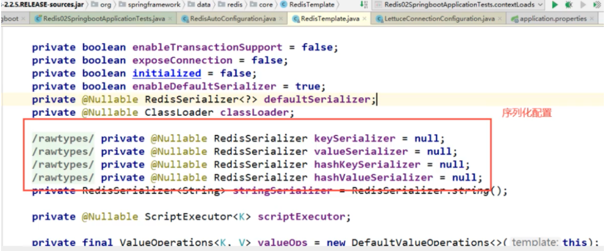


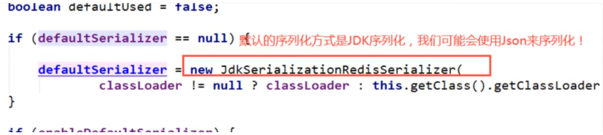


#### 7.1 自定义 RedisTemplate


**关于对象的保存存在的问题：**


```java
	@Test
	void test() throws JsonProcessingException {
		// 真实开发使用JSON来传递对象
		User user = new User("sugar", 3);
		String jsonUser = new ObjectMapper().writeValueAsString(user);  // Jackson
//		redisTemplate.opsForValue().set("user", user);  // 直接传递对象会报错，需要将对象序列化
		redisTemplate.opsForValue().set("user", jsonUser);

		System.out.println(redisTemplate.opsForValue().get("user"));
	}
```


企业开发中，一般将 pojo 类进行序列化，然后进行操作。


1. 将 pojo类 序列化

```java
@Component
@AllArgsConstructor
@NoArgsConstructor
@Data
public class User implements Serializable {

    private String name;

    private int age;
}
```

1. 编写自定义 RedisTemplate

```java
@Configuration
public class RedisConfig {

    // 自定义RedisTemplate
    @Bean
    public RedisTemplate<String, Object> redisTemplate(RedisConnectionFactory redisConnectionFactory)
            throws UnknownHostException {
        // 为了开发方便，直接使用 <String, Object>
        RedisTemplate<String, Object> template = new RedisTemplate<>();
        template.setConnectionFactory(redisConnectionFactory);

        // 默认JDK序列化方式，这里可以配置具体的其他序列化方式
        Jackson2JsonRedisSerializer<Object> objectJackson2JsonRedisSerializer = new Jackson2JsonRedisSerializer<>(Object.class);
        ObjectMapper om = new ObjectMapper();
        om.setVisibility(PropertyAccessor.ALL, JsonAutoDetect.Visibility.ANY);
        om.enableDefaultTyping(ObjectMapper.DefaultTyping.NON_FINAL);
        objectJackson2JsonRedisSerializer.setObjectMapper(om);
        // String的序列化
        StringRedisSerializer stringRedisSerializer = new StringRedisSerializer();

        // key采用String的序列化方式
        template.setKeySerializer(stringRedisSerializer);
        // hash的key也采用String的序列化方式
        template.setHashKeySerializer(stringRedisSerializer);
        // value的序列化方式采用jackson
        template.setValueSerializer(objectJackson2JsonRedisSerializer);
        // hash的value序列方方式采用jackson
        template.setHashValueSerializer(objectJackson2JsonRedisSerializer);
        template.afterPropertiesSet();

        return template;
    }
}
```


#### 7.2 Redis工具类


在真实开发中，一般会自己封装一个RedisUtil，而不是用原生开发。


```java
package com.sugar.utils;

import org.springframework.beans.factory.annotation.Autowired;
import org.springframework.data.redis.core.RedisTemplate;
import org.springframework.stereotype.Component;
import org.springframework.util.CollectionUtils;

import java.util.List;
import java.util.Map;
import java.util.Set;
import java.util.concurrent.TimeUnit;

@Component
public final class RedisUtil {

    @Autowired
    private RedisTemplate<String, Object> redisTemplate;

    /**
     * 指定缓存失效时间
     * @param key   键
     * @param time  时间（秒）
     */
    public boolean expire(String key, long time) {
        try {
            if (time > 0) {
                redisTemplate.expire(key, time, TimeUnit.SECONDS);
            }
            return true;
        } catch (Exception e) {
            e.printStackTrace();
            return false;
        }
    }

    /**
     * 根据 key 获取失效时间
     * @param key  键，不能为null
     * @return 时间（秒），返回0代表永久有效
     */
    public long getExpire(String key) {
        return redisTemplate.getExpire(key, TimeUnit.SECONDS);
    }

    /**
     * 判断key是否存在
     * @param key 键
     * @return true 存在 false 不存在
     */
    public boolean hasKey(String key) {
        try {
            return redisTemplate.hasKey(key);
        } catch (Exception e) {
            e.printStackTrace();
            return false;
        }
    }

    /**
     * 删除缓存
     * @param key  可以传一个或多个值
     */
    public void del(String... key) {
        if (key != null && key.length > 0) {
            if (key.length == 1) {
                redisTemplate.delete(key[0]);
            } else {
                redisTemplate.delete(CollectionUtils.arrayToList(key));
            }
        }
    }


    // ============================== String ==============================

    /**
     * 普通缓存获取
     * @param key 键
     * @return    值
     */
    public Object get(String key) {
        return key == null ? null : redisTemplate.opsForValue().get(key);
    }

    /**
     * 普通缓存存入
     * @param key    键
     * @param value  值
     * @return       true成功 false失败
     */
    public boolean set(String key, Object value) {
        try {
            redisTemplate.opsForValue().set(key, value);
            return true;
        } catch (Exception e) {
            e.printStackTrace();
            return false;
        }
    }

    /**
     * 普通缓存存入并设置时间
     * @param key   键
     * @param value 值
     * @param time  失效时间
     * @return      true成功 false失败
     */
    public boolean set(String key, Object value, long time) {
        try {
            if (time > 0) {
                redisTemplate.opsForValue().set(key, value, time, TimeUnit.SECONDS);
            } else {
                set(key, value);
            }
            return true;
        } catch (Exception e) {
            e.printStackTrace();
            return false;
        }
    }

    /**
     * 递增
     * @param key   键
     * @param delta 递增因子
     */
    public long incr(String key, long delta) {
        if (delta < 0) {
            throw new RuntimeException("递增因子必须大于0");
        }
        return redisTemplate.opsForValue().increment(key, delta);
    }

    /**
     * 递减
     * @param key   键
     * @param delta 递减因子
     */
    public long decr(String key, long delta) {
        if (delta < 0) {
            throw new RuntimeException("递减因子必须大于0");
        }
        return redisTemplate.opsForValue().increment(key, -delta);
    }

    // ============================== Map ==============================

    /**
     * HashGet
     * @param key   键
     * @param item  值
     */
    public Object hget(String key, String item) {
        return redisTemplate.opsForHash().get(key, item);
    }

    /**
     * Hash MGet
     * @param key   键
     * @return 对应的多个键值
     */
    public Map<Object, Object> hmget(String key) {
        return redisTemplate.opsForHash().entries(key);
    }

    /**
     * Hash MSet
     * @param key   键
     * @param map   多个键值
     */
    public boolean hmset(String key, Map<String, Object> map) {
        try {
            redisTemplate.opsForHash().putAll(key, map);
            return true;
        } catch (Exception e) {
            e.printStackTrace();
            return false;
        }
    }

    /**
     * Hash MSet，并设置失效时间
     * @param key   键
     * @param map   多个键值
     * @param time  失效时间
     */
    public boolean hmset(String key, Map<String, Object> map, long time) {
        try {
            redisTemplate.opsForHash().putAll(key, map);
            if (time > 0) {
                expire(key, time);
            }
            return true;
        } catch (Exception e) {
            e.printStackTrace();
            return false;
        }
    }

    /**
     * Hash Set
     * @param key   键
     * @param item  项
     * @param value 值
     */
    public boolean hset(String key, String item, Object value) {
        try {
            redisTemplate.opsForHash().put(key, item, value);
            return true;
        } catch (Exception e) {
            e.printStackTrace();
            return false;
        }
    }

    /**
     * Hash Set，并设置失效时间
     * @param key   键
     * @param item  项
     * @param value 值
     */
    public boolean hset(String key, String item, Object value, long time) {
        try {
            redisTemplate.opsForHash().put(key, item, value);
            if (time > 0) {
                expire(key, time);
            }
            return true;
        } catch (Exception e) {
            e.printStackTrace();
            return false;
        }
    }

    /**
     * Hash Del
     * @param key   键
     * @param item  项
     */
    public void hdel(String key, Object... item) {
        redisTemplate.opsForHash().delete(key, item);
    }

    /**
     * 判断Hash中是否存在该项
     * @param key   键
     * @param item  项
     */
    public boolean hHasKey(String key, String item) {
        return redisTemplate.opsForHash().hasKey(key, item);
    }

    /**
     * Hash递增，如果不存在，则创建一个，并把新增的值返回
     * @param key   键
     * @param item  项
     * @param by    递增因数
     */
    public double hincr(String key, String item, double by) {
        return redisTemplate.opsForHash().increment(key, item, by);
    }

    /**
     * Hash递减
     * @param key   键
     * @param item  项
     * @param by    递减因数
     */
    public double hdecr(String key, String item, double by) {
        return redisTemplate.opsForHash().increment(key, item, -by);
    }

    // ============================== Set ==============================

    /**
     * 根据 key 获取 set中的值
     * @param key   键
     */
    public Set<Object> sGet(String key) {
        try {
            return redisTemplate.opsForSet().members(key);
        } catch (Exception e) {
            e.printStackTrace();
            return null;
        }
    }

    /**
     * 查询 value 在 Set中是否存在
     * @param key   键
     * @param value 值
     */
    public boolean sHasKey(String key, Object value) {
        try {
            return redisTemplate.opsForSet().isMember(key, value);
        } catch (Exception e) {
            e.printStackTrace();
            return false;
        }
    }

    /**
     * 将数据放入Set缓存
     * @param key       键
     * @param values    值
     */
    public long sSet(String key, Object... values) {
        try {
            return redisTemplate.opsForSet().add(key, values);
        } catch (Exception e) {
            e.printStackTrace();
            return 0;
        }
    }

    /**
     * 将数据放入Set缓存，并设置失效时间
     * @param key       键
     * @param values    值
     * @param time 失效时间
     */
    public long sSetAndTime(String key, long time, Object... values) {
        try {
            Long count = redisTemplate.opsForSet().add(key, values);
            if (time > 0) {
                expire(key, time);
            }
            return count;
        } catch (Exception e) {
            e.printStackTrace();
            return 0;
        }
    }

    /**
     * 获取Set缓存的长度
     * @param key   键
     */
    public long sGetSetSize(String key) {
        try {
            return redisTemplate.opsForSet().size(key);
        } catch (Exception e) {
            e.printStackTrace();
            return 0;
        }
    }

    /**
     * 移除值为values的
     * @param key   键
     * @param values    值
     */
    public long setRemove(String key, Object... values) {
        try {
            long count = redisTemplate.opsForSet().remove(key, values);
            return count;
        } catch (Exception e) {
            e.printStackTrace();
            return 0;
        }
    }

    // ============================== List ==============================

    /**
     * 获取List缓存的长度
     * @param key   键
     */
    public long lGetListSize(String key) {
        try {
            return redisTemplate.opsForList().size(key);
        } catch (Exception e) {
            e.printStackTrace();
            return 0;
        }
    }

    /**
     * 根据索引获取List的内容
     * @param key   键
     * @param index 索引
     */
    public Object lGetIndex(String key, long index) {
        try {
            return redisTemplate.opsForList().index(key, index);
        } catch (Exception e) {
            e.printStackTrace();
            return null;
        }
    }

    /**
     * 获取List缓存的内容
     * @param key   键
     * @param start 起始
     * @param end   结束  0到-1代表所有值
     */
    public List<Object> lGet(String key, long start, long end) {
        try {
            return redisTemplate.opsForList().range(key, start, end);
        } catch (Exception e) {
            e.printStackTrace();
            return null;
        }
    }

    /**
     * List Set
     * @param key   键
     * @param value 值
     */
    public boolean lSet(String key, Object value) {
        try {
            redisTemplate.opsForList().rightPush(key, value);
            return true;
        } catch (Exception e) {
            e.printStackTrace();
            return false;
        }
    }

    /**
     * List Set，并设置失效时间
     * @param key   键
     * @param value 值
     * @param time  失效时间
     */
    public boolean lSet(String key, Object value, long time) {
        try {
            redisTemplate.opsForList().rightPush(key, value);
            if (time > 0) {
                expire(key, time);
            }
            return true;
        } catch (Exception e) {
            e.printStackTrace();
            return false;
        }
    }

    /**
     * 批量存入List
     * @param key   键
     * @param values    值
     */
    public boolean lSet(String key, List<Object> values) {
        try {
            redisTemplate.opsForList().rightPushAll(key, values);
            return true;
        } catch (Exception e) {
            e.printStackTrace();
            return false;
        }
    }

    /**
     * 批量存入List
     * @param key   键
     * @param values    值
     * @param time  失效时间
     */
    public boolean lSet(String key, List<Object> values, long time) {
        try {
            redisTemplate.opsForList().rightPushAll(key, values);
            if (time > 0)
                expire(key, time);
            return true;
        } catch (Exception e) {
            e.printStackTrace();
            return false;
        }
    }

    /**
     * 根据索引修改List中的内容
     * @param key   键
     * @param index 索引
     * @param value 值
     */
    public boolean lUpdateIndex(String key, long index, Object value) {
        try {
            redisTemplate.opsForList().set(key, index, value);
            return true;
        } catch (Exception e) {
            e.printStackTrace();
            return false;
        }
    }

    /**
     * 移动N个值为value的
     * @param key   键
     * @param count 移除的数量
     * @param value 值
     */
    public long lRemove(String key, long count, Object value) {
        try {
            long remove = redisTemplate.opsForList().remove(key, count, value);
            return remove;
        } catch (Exception e) {
            e.printStackTrace();
            return 0;
        }
    }
}
```


测试Redis工具类


```java
@SpringBootTest
class Redis02SpringbootApplicationTests {

	@Autowired
	private RedisUtil redisUtil;

	@Test
	void testRedisUtil() {
		redisUtil.set("name", "sugar");
		System.out.println(redisUtil.get("name"));
	}
}
```


------

## 8 Redis.conf 详解


启动的时候，就需要通过配置文件来启动！


#### 8.1 单位

配置文件对单位大小写不敏感

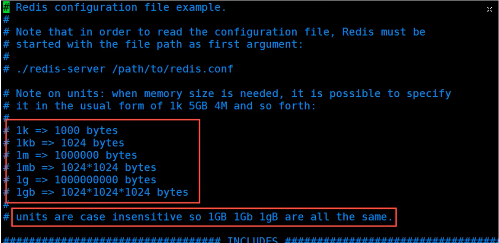


#### 8.2 引入配置文件

类似Spring，可以用 import / include 标签将配置文件包含进来。

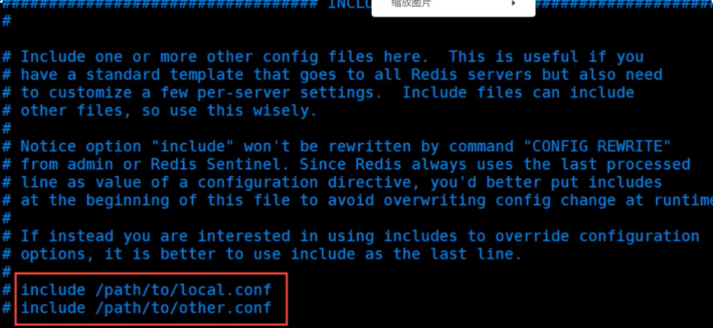


#### 8.3 网络

```bash
bind 127.0.0.1  # 绑定的ip
protected-mode yes  # 保护模式
port 6379  # 端口设置
```


#### 8.4 通用

```bash
daemonize yes  # 以守护进程的方式运行，默认是no，需开启为yes
pidfile /var/run/redis_6379.pid  # 如果以后台方式运行，需要指定一个pid进程文件！
# Specify the server verbosity level.
# This can be one of:
# debug (a lot of information, useful for development/testing)
# verbose (many rarely useful info, but not a mess like the debug level)
# notice (moderately verbose, what you want in production probably)  # 生产环境使用
# warning (only very important / critical messages are logged)
loglevel notice  # 日志级别
logfile ""  		# 日志的文件路径
databases 16  	# 数据库的数量，默认16个
always-show-logo yes  # 是否总是显示logo
```


#### 8.5 快照（RDB配置）


持久化，在规定的时间内，执行了多少次，则会持久化到文件（**.rdb  .aof**）


Redis是内存数据库，如果没有持久化，那么数据断电即失。


```bash
save 900 1  # 如果900秒内，至少有一个key进行了修改，就进行持久化操作
save 300 10  # 300秒之内，如果至少10个key进行修改，进行持久化操作
save 60 10000  # 60秒之内，如果至少10000个key进行修改，进行持久化操作

stop-writes-on-bgsave-error yes  # 持久化如果出错，是否还需要继续工作

rdbcompression yes  # 是否压缩rdf文件（耗费一定CPU资源）

rdbchecksum yes  # 保存rdf文件的时候，运行错误时检查校验

dir ./  # rdf文件保存的陆慕
```


#### 8.6 REPLICATION  主从复制相关

```bash
replicaof <masterip> <masterport>  # 主从配置，配置主机Redis服务的IP和端口
```


#### 8.7 SECURITY  安全

可以在配置文件中设置Redis的密码，默认是没有密码


```bash
127.0.0.1:6379> config set requirepass "123456"  # 设置密码
OK
127.0.0.1:6379> config get requirepass  
1) "requirepass"
2) "123456"
127.0.0.1:6379> auth 123456  # 使用密码登录
OK
```


#### 8.8 限制 CLIENTS、MEMORY MANAGEMENT

```bash
maxclients 10000  # 设置能连接上Redis的最大客户端的数量

maxmemory <bytes>  # Redis 配置最大的内存容量

maxmemory-policy noeviction  # 内存到达上限之后的处理策略（六种
    # 1.volatile-lru：只对设置了过期时间的key进行LRU（默认值）
    # 2.allkeys-lru：删除lru算法的key
    # 3.volatile-random：随机删除即将过期的key
    # 4.allkeys-random：随机删除
    # 5.volatile-ttl：删除即将过期的
    # 6.noeviction：永不过期，返回错误
```


#### 8.9 APPEND ONLY 模式（AOF配置）


```bash
appendonly no  # 默认是不开启aof模式的，默认使用rdf方式持久化，在大部分情况下，rdf完全够用
appendfilename "appendonly.aof"  # 持久化文件的名字  

# appendfsync alawys	# 每次修改都会 sync，消耗性能
appendfsync everysec  # 每秒执行一次sync，可能会丢失这1s的数据
# appendfsync no			# 不执行 sync，这个时候操作系统自己同步数据，速度最快！
```


------

## 9 Redis持久化


Redis 是内存数据库，如果不将内存中的数据库状态保存到磁盘，那么一旦服务器进程退出，服务器中的数据库状态也会消失。所以 Redis 提供了持久化功能！


**在主从复制中，RDB一般作为备用，放在从机上，AOF基本不使用。**


#### 9.1 RDB（Redis DataBase）


##### 9.1.1 What is RDB


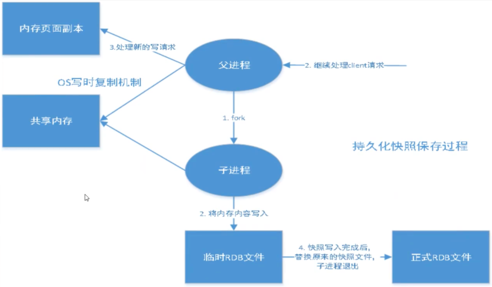


在指定的时间间隔内将内存中的数据集快照写入磁盘，即Snapshot快照，它恢复时是将快照文件直接读到内存里。


Redis会单独创建（fork）一个子进程来进行持久化，会先将数据写入到一个临时文件中，待持久化过程都结束了，再用这个临时文件替换上次持久化好的文件。整个过程中，主进程是不进行任何IO操作的。这确保了极高的性能。如果需要进行大规模数据的恢复，且对于数据恢复的完整性不是非常敏感，那么 RDB 方式要比 AOF 方式更加高效。


RDB 的**缺点**就是最后一次持久化后的数据可能丢失。


RDB 保存的文件是 `dump.rdb`，在配置文件快照中修改。在生产环境中，会将这个文件进行**备份**！


```bash
# The filename where to dump the DB
dbfilename dump.rdb
```


##### 9.1.2 触发机制


1. save的规则满足的情况下，会自动触发 RDB 规则
2. 执行 FLUSHALL 命令，也会触发 RDB 规则。
3. 退出 Redis，也会产生 RDB 文件。


备份会产生一个 dump.rdb 文件


##### 9.1.3 恢复 RDB 文件


1. 只需要将 RDB 文件放在 Redis 启动目录下就可以，Redis启动的时候会自动检查 dump.rdb 恢复其中的数据。
2. 查看需要存在的位置


```bash
127.0.0.1:6379> config get dir
1) "dir"
2) "/usr/local/bin"  # 如果这个目录存在 dump.rdf，启动就会自动恢复其中的数据
```


##### 9.1.4 小结


**优点：**

1. 适合大规模的数据恢复！dump.rdb
2. 对数据的完整性要求不高！


**缺点：**

1. 需要一定时间间隔进行操作！如果Redis意外宕机了，最后一次修改数据就没有了
2. fork进行的时候，会占用一定的内存空间！


#### 9.2 AOF（Append Only File）


##### 9.2.1 What is AOF

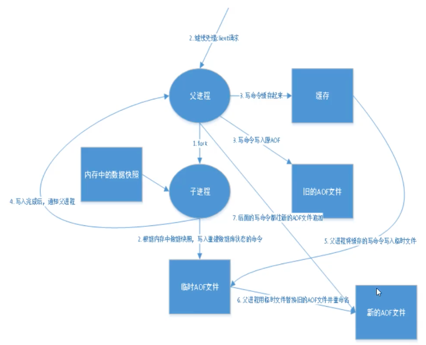


以日志的形式来记录每个写操作，将 Redis 执行过的所有指令记录下来（读操作不记录），只许追加文件但不可以改写文件，Redis 启动之初会读取该文件重新构建数据，换言之，Redis重启的话就根据日志文件的内容将写指令从前到后执行一次以完成数据的恢复工作。


AOF 保存的是 `appendonly.aof` 文件。


##### 9.2.2 APPEND ONLY MODE 配置文件


默认是不开启的，需要手动进行配置。只需修改配置文件为 `appendonly yes`即开启。


重启 Redis 即可生效。


##### 9.2.3 appendonly.aof 文件被破坏


如果这个 aof 文件存在错位，这时的 Redis 是启动不了的，需要修复这个 aof 文件。


```bash
(base) sugar@SugardeMacBook-Pro bin % redis-cli -p 6379
Could not connect to Redis at 127.0.0.1:6379: Connection refused
```


Reids 提供了一个修复工具 `redis-check-aof --fix`，如果文件正常，重启就可恢复。


```bash
(base) sugar@SugardeMacBook-Pro bin % redis-check-aof --fix appendonly.aof
0x              31: Expected \r\n, got: 6166
AOF analyzed: size=128, ok_up_to=41, diff=87
This will shrink the AOF from 128 bytes, with 87 bytes, to 41 bytes
Continue? [y/N]: y
Successfully truncated AOF
```


##### 9.2.4 重写规则说明


AOF默认就是文件的无限追加，导致文件越来越大。


```bash
no-appendfsync-on-rewrite no

auto-aof-rewrite-percentage 100
auto-aof-rewrite-min-size 64mb  # 如果 aof 文件大于64m，就会fork一个新的进程来将文件进行重写！
```


##### 9.2.5 小结


```bash
appendonly no  # 默认是不开启aof模式的，默认使用rdf方式持久化，在大部分情况下，rdf完全够用
appendfilename "appendonly.aof"  # 持久化文件的名字  

# appendfsync alawys	# 每次修改都会 sync，消耗性能
appendfsync everysec  # 每秒执行一次sync，可能会丢失这1s的数据
# appendfsync no			# 不执行 sync，这个时候操作系统自己同步数据，速度最快！
```


**优点：**

1. 每次修改都同步，文件的完整性更好
2. 每秒同步一次，可能会丢失一秒的数据
3. 从不同步，效率最高


**缺点：**

1. 相对于数据文件来说，AOF远远大于RDB，修复的速度也比RDB慢
2. AOF运行效率也要比 RDB 慢，**因此Redis默认配置是 RDB**


#### 9.3 对比RDB和AOF


1. RDB 持久化方式能够在指定的时间间隔内对数据进行快照存储
2. AOF 持久化方式记录每次对服务器写的操作，当服务器重启的时候会重新执行这些命令来恢复原始的数据，AOF命令以Redis协议追加保存每次写的操作到文件末尾，Redis还能对 AOF 文件进行后台重写，使得AOF文件的体积不至于过大。
3. 只做缓存，如果只希望数据在服务器运行时存在，也可以不适用任何持久化。
4. 同时开启两种持久化方式

- - 在这种情况下，当 Redis 重启的时候会优先载入 AOF 文件来恢复原始的数据，因为在通常情况下 AOF文件保存的数据集要比 RDB 文件保存的数据集更加完整。
  - RDB 的数据不实时，同时使用两者时服务器重启也只会找 AOF文件，那要不要只使用 AOF 呢？作者建议不要，因为 RDB 更适合用于备份数据库（AOF 在不断变化不好备份），快速重启，而且不会有 AOF 可能潜在的Bug，留着作为一个万一的手段。

1. 性能建议

- - 因为 RDB文件只用作后备用途，建议只在Slave上持久化RDB文件，而且只要15分钟备份一次就够了，只保留 `save 900 1`这条规则。
  - 如果 Enable AOF，好处是在最恶劣情况下也只会丢失不超过两秒的数据，启动脚本较简单，只load自己的AOF文件就可以，代价一时带来了持续的IO，二是AOF rewrite的最后将 rewrite 过程中产生的新数据写到新文件造成的阻塞几乎不可避免。只要硬盘徐科，应该尽量减少 AOF rewrite 的频率，AOF重写的基础大小默认值64M太小，可以设到 5G 以上，默认超过原大小100%大小重写可以改到适当的数值。
  - 如果不 Enable AOF，仅靠 Master-Slave Replication 实现高可用性也可以，能节省一大笔IO，也减少了rewrite时带来的系统波动。代价是如果Master/Slave同时倒掉（断电），会丢失十几分钟的数据，启动脚本也要比较两个 Master/Slave 中的 RDB文件，载入较新的那个，微博就是这种架构。


------

## 10 Redis 发布订阅


Redis 发布订阅（pub/sub）是一种消息通信模式：发送者（pub）发送消息，订阅者（sub）接收消息。


Redis 客户端可以订阅任意数量的频道。


订阅/发布消息示意图：

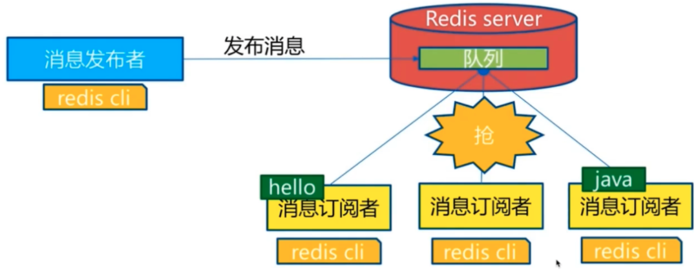


下图展示了频道 channel1，以及订阅这个频道的三个客户端（client1、client2 和 client5 之间的关系）


当有新消息通过 PUBLISH 命令发送到频道 channel1 时，这个消息就会发送给订阅它的三个客户端。

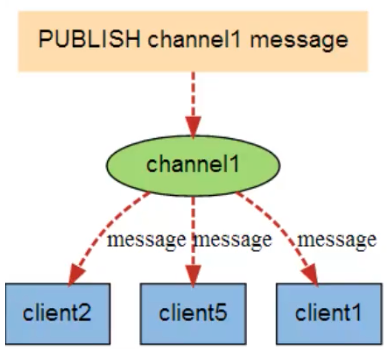


#### 10.1 命令


这些命令广泛用于构建即时通信应用，比如网络聊天室和实时广播、实时提醒等。

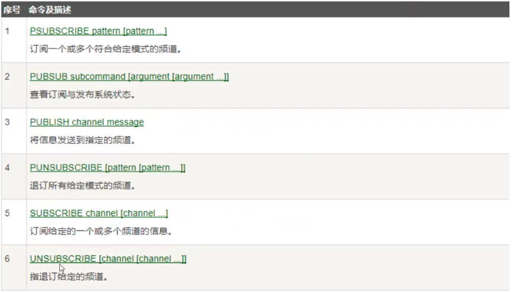


#### 10.2 发布订阅测试


**订阅端**

```bash
127.0.0.1:6379> subscribe channel  # 订阅一个频道，频道名是 channel
Reading messages... (press Ctrl-C to quit)
1) "subscribe"
2) "channel"
3) (integer) 1
# 等待读取推送的信息
1) "message"  # 消息
2) "channel"  # 频道
3) "hello,sugar"  # 消息内容
```


**发送端**

```bash
127.0.0.1:6379> publish channel "hello,sugar"  # 发送消息到频道
(integer) 1
```


#### 10.3 原理


Redis 是使用 C 实现的，通过分析 Redis 源码 里的 pubsub.c 文件，了解发布和订阅机制的底层实现，加深对 Redis 的理解。


Reids 通过 `PUBLISH`、`SUBSCRIBE`和 `PSUBSCRBE`等命令实现发布和订阅功能。


通过 `SUBSCRIBE`命令订阅某频道后，redis-server 里维护了一个字典，字典的键就是一个个 channel，而字典的值则是一个链表，链表中保存了所有订阅这个 channel 的客户端。`SUBSCRIBE`命令的关键，就是将客户端添加到给定 channel 的订阅链表中。


通过 `PUBLISH` 命令向订阅者发布消息，redis-server 会使用给定的频道作为键，在它所维护的 channel 字典里查找记录了订阅这个频道的所有客户端的链表，遍历这个链表，将消息发布给所有的订阅者。


Pub/Sub 从字面上理解就是发布（Publish）与订阅（Subscribe），在 Redis 中，你可以设定对某一个 key 值进行消息发布及消息订阅，当一个 key 值上进行了消息发布后，所有订阅它的客户端都会受到相应的消息，这一功能最明显的用法就是用作实时消息系统，比如普通的即时聊天、群聊等功能。


**使用场景：**

1. 实时消息系统
2. 实时聊天（频道当做聊天室，将信息回显给所有人）
3. 订阅、关注系统


**复杂的场景**：消息中间件 MQ（Kafka。RocketMQ等）


------

## 11 Redis 主从复制


#### 11.1 What is 主从复制


主从复制，是指将一台 Redis 服务器的数据，复制到其他的 Redis 服务器。前者称为主节点（master/leader），后者称为从节点（slave/follower），数据的复制是单向的，只能由主节点到从节点。Master以写为主，Slave以读为主。


默认情况下，每台 Redis 服务器都是主节点，且一个主节点可以有多个从节点（或者没有从节点），但一个从节点只能有一个主节点。


**主从复制的作用主要包括：**

1. 数据冗余：主从复制实现了数据的热备份，是持久化之外的一种数据冗余方式。
2. 故障恢复：当主节点出现问题时，可以由从节点提供服务，实现快速的故障恢复，实际上是一种服务的冗余。
3. 负载均衡：在主从复制的基础上，配合读写分离，可以由主节点提供写服务，由从节点提供读服务（即写 Redis数据时应用连接主节点，读 Redis数据时一样用连接从节点），分担服务器负载；尤其是在写少读多的场景下，通过多个从节点分担读负载，可以大大提高Redis服务器的并发量。
4. 高可用基石：除了上述作用以外，主从复制还是哨兵和集群能够实施的基础，因此说主从复制是Redis高可用的基础。


**一般来说，要将 Redis 运用于工程项目中，只使用一台 Redis是万万不行的，原因如下：**

1. 从结构上，单个 Redis 服务器会发生单点故障，并且一台服务器需要处理所有的请求负载，压力较大；
2. 从容量上，单个 Redis服务器内存容量有限，就算一台 Redis服务器内存容量为 256G，也不能讲所有内存用作 Redis 存储内存，一般来说，单台 Redis最大使用内存不应该超过 20G。


电商网站的商品，一般是一次上传，无数次浏览，即”多读少写“。


这种场景，常采用如下架构：

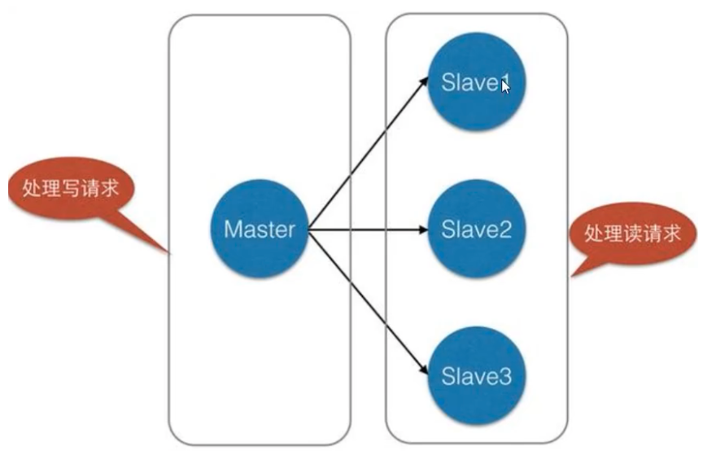


#### 11.2 一主二从结构


只配置从库，不用配置主库！


```bash
127.0.0.1:6379> info replication  # 查看当前库的信息
# Replication
role:master  # 角色 master
connected_slaves:0  # 没有从机
master_replid:606cd8aae7c660de42c429476232d739c26a6985
master_replid2:0000000000000000000000000000000000000000
master_repl_offset:0
second_repl_offset:-1
repl_backlog_active:0
repl_backlog_size:1048576
repl_backlog_first_byte_offset:0
repl_backlog_histlen:0
```


复制三个 Redis 配置文件，修改对应的信息。


```bash
port 6379  												# 端口
pidfile /var/run/redis_6379.pid		# pid名字
logfile "6379.log"								# log文件名字
dbfilename dump6379.rdb						# dump.rdb名字
```


启动三个 Redis 服务，默认三台都是 master。


一主二从：一般情况下只用配置从机即可。一主（79）二从（80，81）


**注意**：如果主机中没有出现从机，可能是因为主机设置了密码，一般密码**配从不配主**。


```bash
# 在从机中查看
127.0.0.1:6380> slaveof 127.0.0.1 6379  # SLAVEOF host 6379 认定 master
OK
127.0.0.1:6380> info replication  
# Replication
role:slave  # 当前角色 slave
master_host:127.0.0.1  # 可以查看主机的信息
master_port:6379
master_link_status:down
master_last_io_seconds_ago:-1
master_sync_in_progress:0
slave_repl_offset:1
master_link_down_since_seconds:1610968547
slave_priority:100
slave_read_only:1
connected_slaves:0
master_replid:8f2f839d4d2b95bd00c5ba0016b8ec953f7c8076
master_replid2:0000000000000000000000000000000000000000
master_repl_offset:0
second_repl_offset:-1
repl_backlog_active:0
repl_backlog_size:1048576
repl_backlog_first_byte_offset:0
repl_backlog_histlen:0

# 在主机中查看
127.0.0.1:6379> info replication
# Replication
role:master
connected_slaves:1  # 多了从机的配置
slave0:ip=127.0.0.1,port=6380,state=online,offset=14,lag=0  
master_replid:c9b5b2c30b49ae04fa0b8bfb7b6618f16d673f0c
master_replid2:0000000000000000000000000000000000000000
master_repl_offset:14
second_repl_offset:-1
repl_backlog_active:1
repl_backlog_size:1048576
repl_backlog_first_byte_offset:1
repl_backlog_histlen:14
```


配置完毕后，主机将有两个从机节点。


真实环境中，主从配置应该是在配置文件中配置，这样的是永久的。这里用命令配置的是暂时的。


细节


主机可以写，从机不能写只能读！主机中的所有信息和数据，都会自动被从机保存！


**主机写**

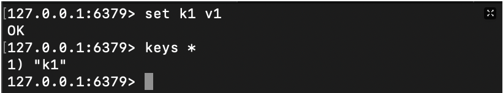


**从机读**


**测试：**若主机宕机，从机依然是连接到主机的，但是没有写操作；这是如果主机回来了，从机依旧可以直接同步到主机写的信息。


如果是使用命令行配置主从的，如果从机断开重启了，就会变回主机！但这是通过命令行将其变为从机，会立即从主机同步所有数据。


复制原理


Slave 启动成功连接到 master 后会发送一个 sync 命令。


Master 接到命令，启动后台的存盘进程，同时收集所有接收到的用于修改数据集命令，在后台进程执行完毕之后，master 将传送整个数据文件到 slave，并完成一次完全同步。


**全量复制**：而 Slave 服务在接收到数据库文件数据后，将其存盘并加载到内存中。


**增量复制**：Master 继续将新的所有收集到的修改命令一次传给 Slave，完成同步。


但是只要重新连接 master，一次完全同步（全量复制）将被自动执行。数据一定可以在从机中看到。


#### 11.3 层层链路结构


79  <-  80  <- 81，上一个M链接下一个S。


其中 80 依然是从节点，不能写入的。


如果主机断开了连接，从机可以使用 `SLAVEOF no one` 让自己变成主节点。其他的节点就可以手动连接到最新的这个主节点。这时主机恢复了连接，需要手动配置主从关系到该主节点。


#### 11.4 哨兵模式（工作中真正使用的模式）


（自动选举老大的模式）


概述


主从切换技术的方法是：当主服务器宕机后，需要手动把一台从服务器切换为主服务器，这就需要人工干预，费事费力，还会造成一段时间内服务不可用。这不是一种推荐的方法，更多时候优先考虑**哨兵模式**。Reids从2.8开始正式提供了Sentinel（哨兵）架构来解决这个问题。


谋朝篡位的自动版，能够后台监控主机是否故障，如果故障了根据投票数自动将从库转换为主库。


哨兵模式是一种特殊的模式，首先 Redis 提供了哨兵的命令，哨兵是一个独立的进程。作为进程，它会独立运行。其原理是**哨兵通过发送命令，等待 Redis 服务器响应，从而监控运行的多个 Redis 实例**。

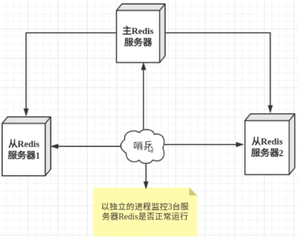


这里的哨兵有两个作用：


- 通过发送命令，让 Redis 服务器返回监控其运行状态，包括主服务器和从服务器。
- 当哨兵检测到 master 宕机，会自动将 slave 切换成 master，然后通过**发布订阅模式**通知其他的从服务器，修改配置文件，让它们切换主机。


然而一个哨兵进程对Redis服务器进行监控，可能会出现问题，为此，可以使用多个哨兵进行监控。各个哨兵之间还会进行监控，这样就形成了多哨兵模式。

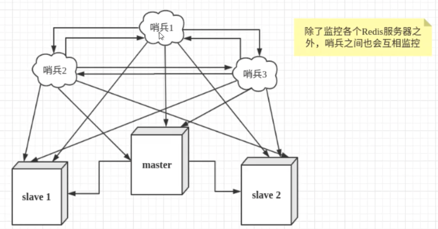


假设主服务器宕机，哨兵1先检测到这个结果，系统并不会马上进行 failover 过程，仅仅是哨兵1主观的认为主服务器不可用，这个现象称为**主观下线**，当后面的哨兵也检测到主服务器不可用，**并且数量达到一定值时，那么哨兵之间就会进行一次投票**，投票的结果由一个哨兵发起，进行 failover[故障转移] 操作。切换成功后，就会通过发布订阅模式，让各个哨兵把自己的监控的从服务器实现切换主机，这个过程称为**客观下线**。


测试


目前的状态，一主二从。


1. 配置哨兵配置文件 `sentinel.conf`

```bash
# sentinel monitor 被监控的名称 host port 1  # 数字1代表主机挂了，slave投票让谁接替成为主机，票数最多的就会成为主机
sentinel monitor myredis 127.0.0.1 6379 1
```

1. 命令行启动哨兵

```bash
redis-sentinel conf/ sentinel.conf
```

1. 如果Master节点断开了，这个时候就会从从机中随机选择一个服务器作为主服务器。（有一个投票算法）
2. 如果主节点回来了，只能作为新主节点的从节点。
3. 哨兵日志


**优点：**

1. 哨兵集群，基于主从复制模式，所有的主从配置优点，它全有
2. 主从可以切换，故障可以转移，系统的可用性会更好
3. 哨兵模式就是主从模式的升级，手动到自动，更加健壮！


**缺点：**

1. Redis不好在线扩容了，集群容量一旦达到上限，在线扩容就十分麻烦！
2. 实现哨兵模式的配置其实很麻烦，（哨兵模式额全部配置 略）


------

## 12 Redis 缓存穿透和雪崩


Redis缓存的使用，极大提升了应用程序的性能和效率，特别是数据查询方面，但同时也带来一些问题，其中，最重要的问题，就是数据的一致性问题，从严格意义上讲，这个问题无解。如果对数据的一致性要求很高，那么就不能使用缓存。


另外的一些典型问题就是，**缓存穿透**，**缓存雪崩**和**缓存击穿**。目前，业界也有比较流行的解决方案。


#### 12.1 缓存穿透（查不到）


概念


缓存穿透，就是用户想要查询一个数据，发现 Redis 内存数据库没有，即缓存没有命中，于是向持久层数据库查询，发现也没有，于是本次查询失败。当用户很多的时候，缓存都没有命中，于是都去请求了持久层数据库，这给持久层数据库造成了很大的压力，相当于出现了缓存穿透。

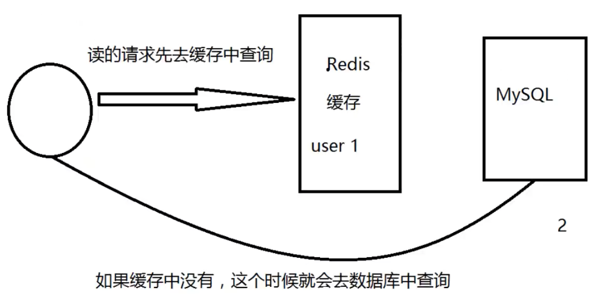


解决方案


##### 方案一：布隆过滤器


布隆过滤器是一种数据结构，对所有可能查询的参数以hash形式存储，在控制层先进行校验，不符合则丢弃，从而避免了对底层存储系统的查询压力。（还可用于亿级的黑名单过滤，该过滤器存在一定的误判，但原则是宁可错杀，不可放过）

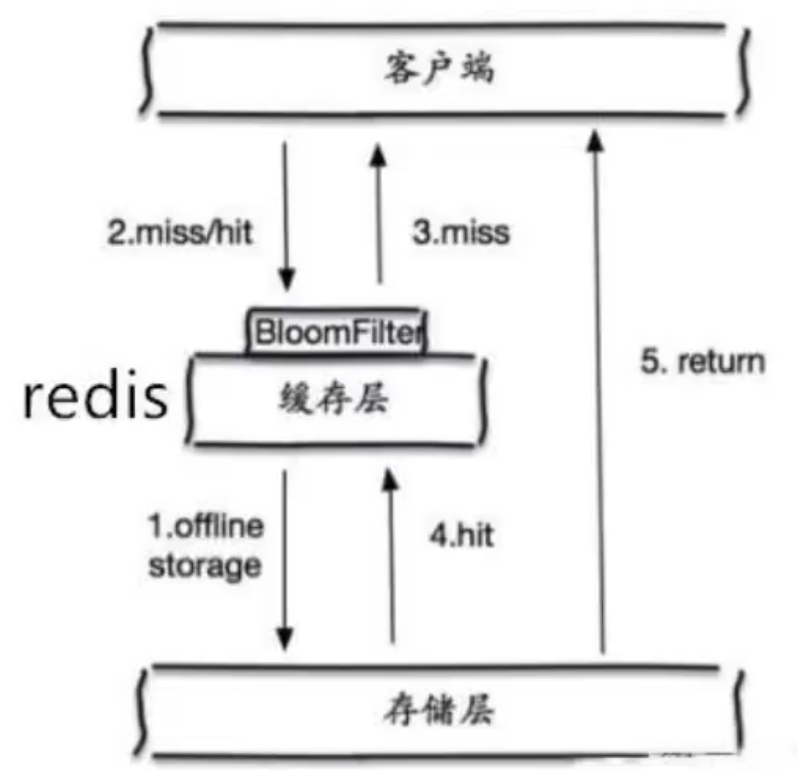


##### 方案二：缓存空对象


当存储层不命中后，即使返回的空对象也将其缓存起来，同时会设置一个过期时间，之后再访问这个数据将会从缓存中获取，保护了后端数据源。


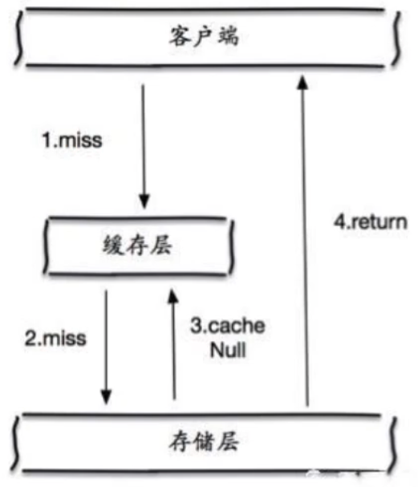


**但这种方法存在两个问题：**

1. 如果空值能够被缓存起来，这意味着缓存需要更多的空间存储更多的值，因为这当中可能会有很多的空值的键
2. 即使对空值设置了过期时间，还是会存在缓存层和存储层的数据会有一段时间窗口的不一致，这对于需要保持一致性的业务会有影响。


#### 12.2 缓存击穿（查的太多）


概述


这里需要注意和缓存穿透的区别，缓存击穿是指一个key非常热点，在不停地扛着大并发，大并发集中对这一个点进行访问，当这个key在失效的瞬间，持续的大并发就穿破缓存，直接请求数据库，就像在一个屏障上凿开了一个洞。


当某个key在过期的瞬间，有大量的请求并发访问，这类数据一般是热点数据，由于缓存过期，会同时访问数据库来查询最新数据，并且回写缓存，导致数据库瞬间压力过大。


解决方案


##### 方案一：设置热点数据永不过期


从缓存层面来看，没有设置过期时间，所以不会出现热点 key 过期后产生的问题。


##### 方案二：加互斥锁


分布式锁：使用分布式锁，保证对于每个key同时只有一个线程去查询后端服务，其他线程没有获得分布式锁的权限，因此只需要等待即可。这种方式将高并发的压力转移到了分布式锁，因此对于分布式锁的考验很大。

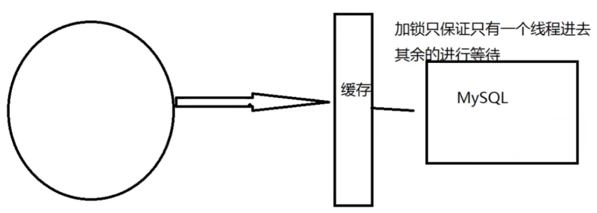


#### 12.3 缓存雪崩


概念


缓存雪崩，是指在某一个时间段，缓存集中过期失效。


产生雪崩的原因之一，比如快到双十一零点，很快会迎来一波抢购，这波商品时间比较集中的放入了缓存，假如设置缓存有效时间为一个小时，那么到了凌晨一点钟的时候，这批商品的缓存就都过期了，而对这批商品的访问查询，都落到了数据库上，对于数据库而言，就会产生周期性的压力波峰。于是所有的请求都会达到存储层，存储层的调用量会暴增，造成存储层也会挂掉的情况。


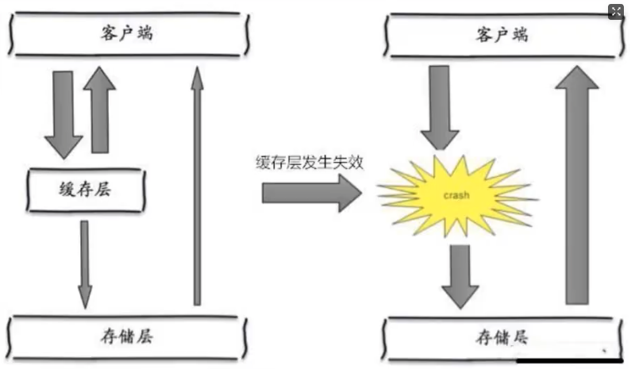


集中过期倒不是非常致命，比较致命的是缓存雪崩，是缓存服务器某个节点宕机或断网。因为自然形成的缓存雪崩，一定是在某个时间段集中创建缓存，这个时候，数据库也是可以顶住压力的，无非就是对数据库产生周期性的压力而已。而缓存服务节点的宕机，对数据库服务器造成的压力是不可预知的，很有可能瞬间就把数据库压垮。


双十一：停掉一些服务，保证主要的服务可用！


解决方案


##### 方案一：Redis高可用


这个思想的含义是，既然 Redis 有可能挂掉，就多增设几台 Redis，这样一台挂掉之后其他的还可以继续工作，其实就是搭建集群。


##### 方案二：限流降级


这个解决方案的思想是，在缓存失效后，通过加锁或者队列来控制读数据库写缓存的线程数量。比如对某个key只允许一个线程查询数据和写缓存，其他线程等待。


##### 方案三：数据预热


数据加热的含义就是在正式部署之前，先把可能的数据预先访问一遍，这样部分可能大量访问的数据就会加载到缓存中。在即将发生并发访问前手动触发加载缓存不同的key，设置不同的过期时间，让缓存失效的时间点尽量均匀。